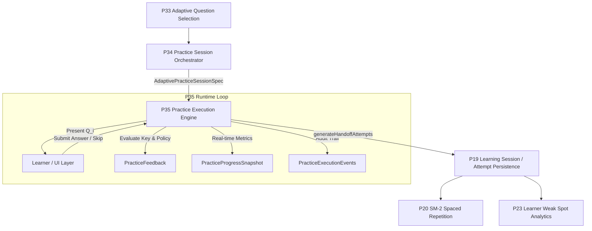

# P35 — Adaptive Practice Execution + Real-Time Feedback Orchestration

**Specification Version**: `TITAN-KO-035.0`  
**Package**: `garuda_learning`  
**Parent Integration**: P34 Adaptive Practice Session Orchestrator  
**Downstream Integration**: P19 Learning Session State Machine & Evidence Handoff  
**Architecture Principle**: Clean Architecture, SOLID, Immutable Transient State, Deterministic Execution  

---

## 1. Executive Summary & Mission

The **Adaptive Practice Execution Engine (P35)** provides the runtime orchestration and feedback evaluation layer for active practice sessions specified by P34. 

While **P34** determines *what* questions are grouped into a practice session and in *what order*, **P35** deterministically manages the runtime execution:
1. Presenting the sequential cursor question from the P34 specification.
2. Maintaining transient execution state without touching permanent database records.
3. Validating learner answer submissions against strict exam and session boundaries.
4. Evaluating immediate correctness against authoritative official answer keys.
5. Generating policy-compliant real-time feedback (Immediate, Deferred, Exam Simulation).
6. Providing $O(1)$ real-time progress snapshots (completion ratio, accuracy, elapsed duration).
7. Recording an immutable, chronological event audit trail.
8. Generating evidence-ready P18 `QuestionAttempt` handoff records for persistence in P19.



---

## 2. Hard Architectural Boundaries

To preserve architectural integrity across Project TITAN, P35 enforces strict operational boundaries:

| Layer / Concern | Owner | P35 Relationship |
| :--- | :--- | :--- |
| **PYQ Ingestion & Normalization** | `garuda_pyq` (P29/P30) | Read-only input source |
| **Historical PYQ Intelligence** | `garuda_learning` (P31) | Read-only input source |
| **Adaptive Priority Scoring** | `garuda_learning` (P32) | Read-only input source |
| **Learner Weakness Analytics** | `garuda_learning` (P23) | Read-only input source |
| **Question Selection & Constraints** | `garuda_learning` (P33) | Read-only input source |
| **Session Specification & Ordering** | `garuda_learning` (P34) | Direct parent specification |
| **Runtime Execution & Feedback** | **`garuda_learning` (P35)** | **Authoritative Owner** |
| **Persistent Attempt Storage & Sessions** | `garuda_learning` (P18/P19) | Downstream consumer via handoff |
| **SM-2 Spaced Repetition** | `garuda_learning` (P20) | Downstream consumer via P19 |

### Absolute Invariants
- **Transient State Only**: P35 never accesses or mutates SQL/NoSQL databases directly. State is held in immutable data structures and passed back to callers.
- **Zero Question Fabrication**: Questions presented to learners match the authoritative corpus verbatim.
- **Zero Answer Key Tampering**: Official commission answer keys and dropped-question semantics are preserved without alteration.
- **Zero Cognitive / Scientific Predictions**: P35 evaluates correctness for practice; it makes no claims of predicting future exam performance or cognitive intelligence.
- **Zero `DateTime.now()` Drift**: All temporal calculations use explicit, caller-supplied timestamps for deterministic replayability.

---

## 3. Domain Model Architecture

### 3.1 Lifecycle Status (`PracticeExecutionStatus`)
```
[notStarted] ---> startSession() ---> [inProgress]
                                           |
                    +----------------------+----------------------+
                    |                      |                      |
             pauseSession()         submitAnswer() /         abandonSession()
                    |               skipQuestion() (all)          |
                    v                      |                      v
                [paused]                   v                 [abandoned] (terminal)
                    |                 [completed]
             resumeSession()          (terminal)
                    |
                    +--> [inProgress]
```

### 3.2 Feedback Exposure Policies (`PracticeFeedbackPolicy`)
1. **`immediate`**: Full correctness, authoritative explanation, and correct answer keys are returned immediately upon submission.
2. **`deferred`**: Correctness is recorded internally; detailed explanations and keys are withheld until session completion.
3. **`examSimulation`**: Strict test condition simulation. Both correctness and explanations are hidden during execution, revealed only in the final completion summary.

### 3.3 Core Entity Specifications

#### `PracticeFeedback`
```dart
class PracticeFeedback {
  final String questionId;
  final bool isCorrect;
  final String submittedAnswer;
  final String correctAnswer;
  final String explanation;
  final bool isExplanationExposed;
  final EvaluationMethod evaluationMethod;
  final String? feedbackText;
}
```

#### `PracticeProgressSnapshot`
```dart
class PracticeProgressSnapshot {
  final int totalQuestions;
  final int currentQuestionIndex;
  final int currentQuestionNumber;
  final int answeredCount;
  final int correctCount;
  final int incorrectCount;
  final int skippedCount;
  final int remainingCount;
  final double completionRatio;        // [0.0, 1.0]
  final double accuracyAmongAnswered; // [0.0, 1.0] (0.0 if answered == 0)
  final int totalElapsedSeconds;
}
```

#### `PracticeCompletionSummary`
```dart
class PracticeCompletionSummary {
  final String sessionId;
  final String examId;
  final String? learnerId;
  final PracticeExecutionStatus status;
  final int totalQuestions;
  final int answeredCount;
  final int correctCount;
  final int incorrectCount;
  final int skippedCount;
  final double score;                  // correctCount / totalQuestions
  final double accuracy;               // correctCount / answeredCount
  final int totalDurationSeconds;
  final double averageSecondsPerQuestion;
  final DateTime startedAt;
  final DateTime completedAt;
  final Map<String, PracticeObjectiveSummary> objectivePerformance;
  final Map<String, PracticeTopicSummary> topicPerformance;
  final List<PracticeQuestionResult> results;
}
```

---

## 4. Execution Engine API (`AdaptivePracticeExecutionEngine`)

| Method | Description | Error Codes Handled |
| :--- | :--- | :--- |
| `initializeSession` | Creates unattempted transient execution state from P34 spec | None (pure factory) |
| `startSession` | Transitions state from `notStarted` to `inProgress`, presents Q0 | `invalidTransition` |
| `getCurrentQuestion` | Returns the currently active question entity | None (pure getter) |
| `submitAnswer` | Validates answer, evaluates correctness, constructs feedback, advances cursor | `sessionNotStarted`, `sessionCompleted`, `sessionAbandoned`, `sessionPaused`, `questionNotFound`, `wrongQuestion`, `questionAlreadyAnswered`, `invalidAnswer`, `crossExamMismatch` |
| `skipQuestion` | Skips current question without penalty, advances cursor | `skipNotAllowed`, `invalidTransition`, `questionNotFound`, `wrongQuestion`, `questionAlreadyAnswered` |
| `pauseSession` | Temporarily suspends active execution | `invalidTransition` |
| `resumeSession` | Resumes paused execution | `invalidTransition` |
| `abandonSession` | Terminates active session early | `invalidTransition` |
| `generateHandoffAttempts` | Converts answered results into evidence-ready P18 `QuestionAttempt` objects | None (pure converter) |

---

## 5. Performance Benchmarks

Benchmarked on Flutter/Dart VM (Windows 11, x86_64):

| Benchmark Scenario | Volume | Latency | Verification Result |
| :--- | :--- | :--- | :--- |
| **Question Entity Lookup** | 1,000 lookups | **0.64 µs** / lookup | PASS (< 1 ms) |
| **Answer Transition & Evaluation** | 1,000 answers | **88.93 µs** / answer | PASS (< 1 ms) |
| **1K Full Session Execution** | 1,000 answers | **94 ms** | PASS (< 500 ms) |
| **10K Session Initialization & Start** | 10,000 questions | **5 ms** | PASS (< 50 ms) |
| **50K Session Initialization & Start** | 50,000 questions | **21 ms** | PASS (< 200 ms) |
| **100K Session Initialization & Start** | 100,000 questions | **71 ms** | PASS (< 500 ms) |
| **10K Completion Summary Compilation** | 10,000 results | **12 ms** | PASS (< 50 ms) |
| **10K P19 Handoff Generation** | 10,000 attempts | **2 ms** | PASS (< 50 ms) |
| **Deterministic Replay (10 runs)** | 10 replays | Byte-identical JSON | PASS (100% Determinism) |

---

## 6. Test Suite & Verification Matrix

### Unit & Property Test Matrix (`packages/garuda_learning/test/p35_adaptive_practice_execution_test.dart`)
- **Group 1**: Configuration, Initialization & State Transitions (10 tests) — **PASS**
- **Group 2**: Question Presentation & Sequential Cursor (10 tests) — **PASS**
- **Group 3**: Answer Submission & Validation (10 tests) — **PASS**
- **Group 4**: Correctness Determination (10 tests) — **PASS**
- **Group 5**: Feedback Policies (Immediate, Deferred, Exam Simulation) (10 tests) — **PASS**
- **Group 6**: Skip Handling & Transition (10 tests) — **PASS**
- **Group 7**: Real-Time Progress Metrics ($O(1)$, Zero NaN/Infinity) (10 tests) — **PASS**
- **Group 8**: Event Generation & Audit Trail (10 tests) — **PASS**
- **Group 9**: Structured Error Model & Idempotency (10 tests) — **PASS**
- **Group 10**: P19 Evidence-Ready Handoff Records (10 tests) — **PASS**
- **Group 11**: Safety, Multi-Exam Isolation & Property Invariants (10 tests) — **PASS**
- **Group 12**: Replay Determinism & High-Throughput Benchmarks (12 tests) — **PASS**
- **Total Unit Tests**: **122 / 122 PASSED**

### Root Integration Test Matrix (`test/p35_adaptive_practice_execution_integration_test.dart`)
- **Pipeline Test 1**: Full E2E Pipeline ($P30 \to P29 \to P31 \to P32 \to P23 \to P33 \to P34 \to P35 \to P19$) — **PASS**
- **Pipeline Test 2**: Exam Simulation Mode Execution & Privacy Review — **PASS**
- **Pipeline Test 3**: Deterministic Pipeline Replay — **PASS**
- **Total Root Integration Tests**: **3 / 3 PASSED**
