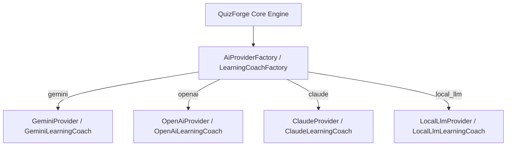
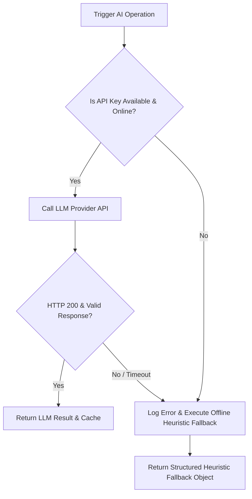

# QuizForge AI AI Guidelines & Governance

This document establishes the guidelines, prompt engineering standards, safety guardrails, token optimization strategies, provider abstractions, and fallback policies for AI integration in **QuizForge AI**.

---

## 1. Provider Abstraction Architecture

To avoid tight coupling to any single AI vendor, all AI services in QuizForge AI MUST interact with abstract interfaces rather than concrete API clients:



### Mandated Architectural Rules
1. Never import `http` or vendor SDKs directly in UI pages or controllers.
2. Always access AI services through `AIProvider` or `LearningCoach` contracts.
3. Keep API key loading encapsulated inside `ApiKeyRepository` utilizing `flutter_secure_storage`.

---

## 2. Prompt Engineering Standards

Prompts sent to LLM providers MUST follow structured, repeatable standards:

### Core Prompt Rules
1. **System Persona Framing**: Always frame the LLM as an expert UPSC Civil Services AI Tutor/Coach.
2. **Explicit Output Format**: Request raw JSON without markdown codeblock wrapper formatting when parsing machine-readable outputs (`generationConfig: {"temperature": 0.2}`).
3. **Constraint Specification**: Explicitly state string lengths, item counts, and fallback options.

### Sample Standard Prompt Template
```text
You are an expert UPSC Civil Services AI Learning Coach.
Analyze the following student performance metrics:
- Overall Accuracy: {accuracy}%
- Weak Subjects: {weakSubjects}

Provide a structured analysis JSON with exact keys:
1. "weeklyReport": (Concise summary string)
2. "weakTopics": (Array of top weak topic strings)
3. "recommendedPyqs": (Array of 3-5 recommended PYQ titles)
4. "recommendedAiQuizzes": (Array of 3-5 recommended AI quiz names)
5. "studyHoursSuggestion": (Object mapping subject strings to hours float)
6. "motivationalInsights": (Empowering mindset quote string)

Return ONLY valid raw JSON.
```

---

## 3. AI Safety & Privacy Guardrails

1. **Zero PII Leakage**: Never transmit student personal identifiers (name, email, device ID, location) in prompts sent to remote LLM endpoints.
2. **Encrypted Credentials**: API keys MUST be stored in platform-encrypted storage via `flutter_secure_storage`. They MUST NEVER be hardcoded or written to version control.
3. **Hallucination Redaction**: Generated questions and explanations must be validated against official UPSC answer key specifications (`officialAnswer`).

---

## 4. Token Optimization & Cost Reduction

1. **Prompt Payload Minification**: Strip redundant whitespaces and unnecessary preamble text before sending prompts.
2. **Low Temperature Setting**: Use `temperature: 0.2` to `0.3` for factual Q&A and analytics parsing to minimize unnecessary output tokens.
3. **Response Caching**: `CacheService` caches LLM responses in memory and Hive disk cache keyed by prompt SHA-256 hash. Repeated calls for identical questions return cached results instantly with zero network costs.

---

## 5. Fallback & Offline Heuristics Strategy

When an AI API call fails due to missing credentials, rate limits, timeout (>30s), or network disconnects:



### Guaranteed Fallback Contracts
All provider methods MUST catch exceptions internally and return deterministic, non-null rule-based fallback objects. App execution MUST NEVER crash due to AI failure.
