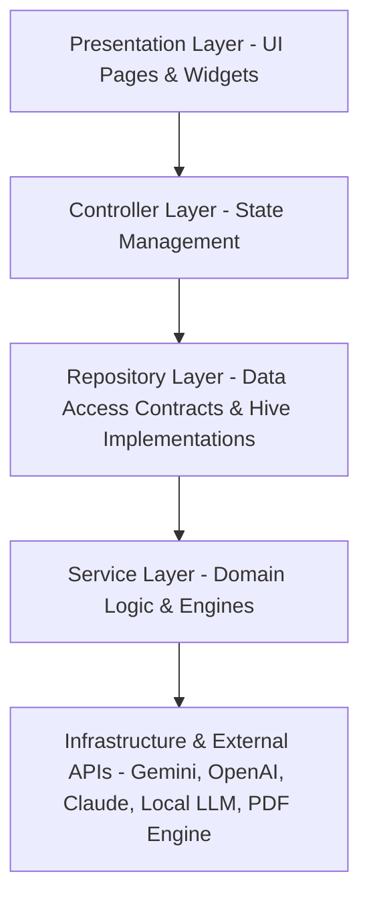
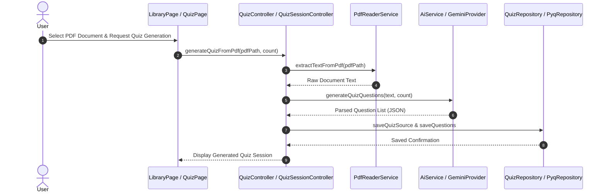
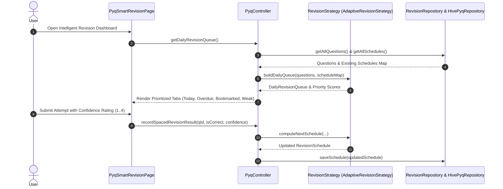

# QuizForge AI Architecture Specification

This document provides a comprehensive description of the system architecture, data flows, module boundaries, dependency rules, and extension points for **QuizForge AI**.

---

## 1. High-Level Architectural Pattern

QuizForge AI follows a strict **Layered Architecture**:

### Layer Responsibilities

1. **Presentation Layer (`lib/pages`, `lib/widgets`)**:
   - Renders Material 3 user interfaces.
   - Accepts user interactions and delegates actions to State Controllers.
   - Observes state changes via `AnimatedBuilder`, `ListenableBuilder`, or `ChangeNotifier`.

2. **Controller Layer (`lib/controllers`)**:
   - Manages UI state and session lifecycles (`QuizSessionController`, `AnalyticsController`, `LearningCoachController`, `PyqController`).
   - Translates raw user actions into repository and service calls.
   - Free from direct rendering logic.

3. **Repository Layer (`lib/repositories`, `lib/repositories/impl`)**:
   - Defines abstract contracts for data persistence (`PyqRepository`, `AnalyticsRepository`, `BookmarkRepository`, `RevisionRepository`).
   - Implements data persistence using local Hive storage, Secure Storage (`ApiKeyRepository`), and memory caches.

4. **Service Layer (`lib/services`, `lib/services/ai`)**:
   - Houses core domain logic, calculation engines, and processing utilities.
   - Includes `AnalyticsService`, `AnalyticsEngine`, `SpacedRepetitionScheduler`, `AdaptiveRevisionStrategy`, `DatasetLoader`, `DatasetValidator`, `PdfReaderService`.

5. **Infrastructure & External Services Layer (`lib/services/ai/providers`, `lib/plugins`)**:
   - Encapsulates network operations with external LLM APIs (Gemini REST API, OpenAI API, Anthropic Claude API, Local LLM endpoints).

---

## 2. End-to-End Data Flows

### A. Quiz Generation & PDF Processing Data Flow

### B. Intelligent Spaced Repetition Data Flow

---

## 3. Module Boundaries & Dependency Rules

### Strict Layering Rules
1. **Presentation Layer** MUST NEVER directly invoke Services or External APIs. It must route all requests through Controllers.
2. **Controller Layer** MUST depend ONLY on Repositories and Services via dependency injection or interfaces.
3. **Repository Layer** MUST NOT depend on Controllers or UI elements.
4. **Services Layer** MUST remain pure and independent of Flutter UI components (`BuildContext`, `Widget`).

### Circular Dependency Guard
No circular dependencies are permitted between packages or directories:
- `lib/models` -> Dependencies: None (Pure Domain Objects)
- `lib/repositories` -> Dependencies: `lib/models`
- `lib/services` -> Dependencies: `lib/models`, `lib/repositories`
- `lib/controllers` -> Dependencies: `lib/models`, `lib/repositories`, `lib/services`
- `lib/pages` & `lib/widgets` -> Dependencies: `lib/models`, `lib/controllers`

---

## 4. Extension Points & Pluggability

QuizForge AI uses the **Strategy** and **Factory** patterns to enable seamless extension:

### A. AI Providers & AI Learning Coach (`lib/services/ai`)
- **Abstract Interfaces**: `AIProvider`, `LearningCoach`
- **Factories**: `AiProviderFactory`, `LearningCoachFactory`
- **Registered Implementations**:
  - `GeminiProvider` / `GeminiLearningCoach`
  - `OpenAiProvider` / `OpenAiLearningCoach`
  - `ClaudeProvider` / `ClaudeLearningCoach`
  - `LocalLlmProvider` / `LocalLlmLearningCoach`
- **Extension Method**: To add a new provider (e.g. DeepSeek), implement `AIProvider` / `LearningCoach` and register it with the factory.

### B. Spaced Repetition Algorithms (`lib/services/revision_strategy.dart`)
- **Abstract Interface**: `RevisionStrategy`
- **Default Implementation**: `AdaptiveRevisionStrategy`
- **Extension Method**: Replace or customize the scheduling logic by invoking `SpacedRepetitionScheduler.setStrategy(NewCustomStrategy())`.

### C. Modular Plugin System (`lib/plugins`)
- Extensible plugin architecture with standard contracts (`BaseModule`, `ModuleRepository`, `ModuleImporter`, `ModuleAnalytics`, `ModuleUI`).
