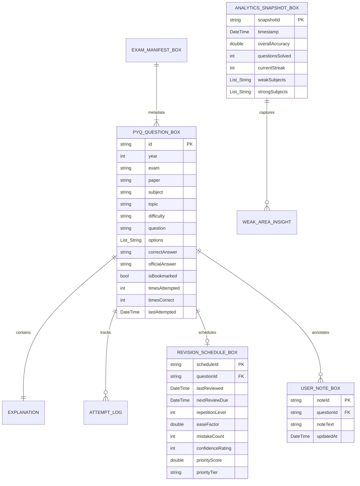
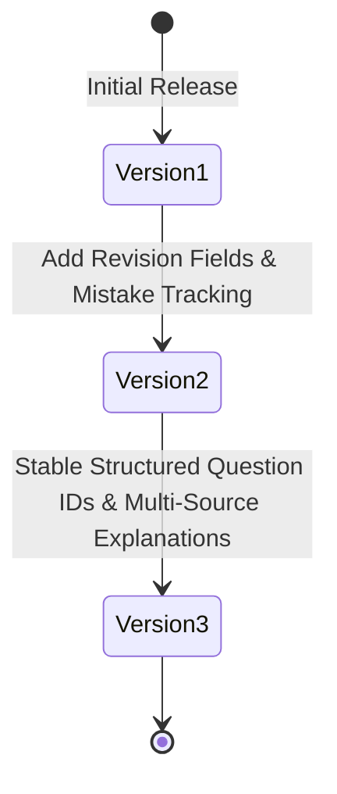

# QuizForge AI Database & Storage Specification

This document details the database architecture, Entity Relationship Diagrams (ERD), schema versioning, indexing strategies, and storage optimizations for **QuizForge AI**.

---

## 1. Entity Relationship Diagram (ERD)

QuizForge AI uses a structured local Hive storage engine with the following entity relationships:

---

## 2. Database Boxes & Persistence Layout

Hive boxes are partitioned by concern for optimal I/O performance:

| Box Identifier | Model Class | Storage Format | Purpose |
| :--- | :--- | :--- | :--- |
| `pyq_questions_v2` | `PyqQuestionModel` | Encoded JSON String | Master past year question bank & attempt state |
| `engine_analytics_snapshots` | `AnalyticsSnapshot` | Encoded JSON String | Historical performance trend snapshots |
| `engine_revision_schedules` | `RevisionSchedule` | Encoded JSON String | Spaced repetition intervals and priority scores |
| `user_bookmarks` | String ID Set | Direct String Keys | Fast bookmark lookup |
| `user_notes` | `UserNote` | Encoded JSON String | Student personal study notes |
| `secure_api_keys` | `ApiKeyRepository` | `flutter_secure_storage` | Encrypted API keys (Gemini, OpenAI, Claude) |

---

## 3. Schema Versioning & Migration Rules

### Current Version: **Schema Version 3**

### Migration Safety Rules
1. **Downgrade Guard**:
   If a client attempts to initialize a database version lower than the current version (`targetVersion < currentVersion`), execution halts immediately and throws `DowngradeNotSupportedException`.
2. **Atomic Pre-Migration Backup**:
   Before initiating any step migration (e.g. `v1 -> v2` or `v2 -> v3`), `MigrationManager` exports all Hive box keys and values into an encrypted JSON string backup.
3. **Automatic Rollback**:
   If an error occurs during migration, `MigrationManager` clears partial states and restores the exact pre-migration backup.

---

## 4. Indexing & Fast Query Strategy

To ensure zero-lag search and filtering across 10,000+ questions on mobile devices:

1. **Primary Stable ID Index**:
   Hive box keys map 1-to-1 to stable structured question IDs (`EXAM_PAPER_YEAR_Q###`). Lookups by ID run in $O(1)$ time.
2. **In-Memory Inverted Category Indices**:
   Upon app startup, `HivePyqRepository` builds lightweight in-memory lookup maps:
   - `subjectIndex`: `Map<String, Set<String>>`
   - `topicIndex`: `Map<String, Set<String>>`
   - `yearIndex`: `Map<int, Set<String>>`
3. **Filter Bitmasks**:
   Combining `subject`, `year`, `difficulty`, `isBookmarked`, and `isIncorrect` filters uses set intersections, reducing filter execution time to < 2 milliseconds.

---

## 5. Storage Optimization Techniques

- **Compact JSON Encoding**: Omits null/default values from stored JSON payloads.
- **Lazy Box Opening**: Hive boxes for historical analytics and notes are opened lazily only when navigated to.
- **Cache Eviction**: `CacheService` employs an LRU (Least Recently Used) memory cache capped at 500 active items with automatic expiration.
