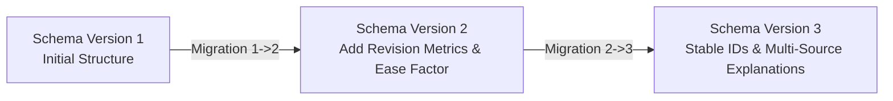
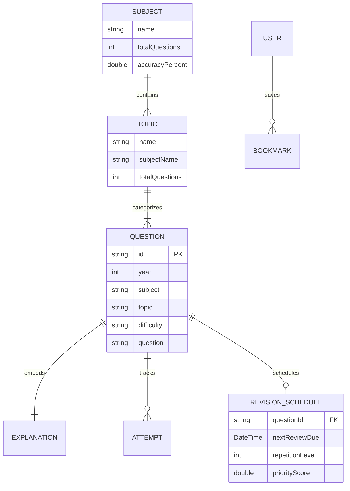

# QuizForge AI Data Specification

This document details the JSON schemas, validation rules, migration pipeline, and Knowledge Graph specifications for **QuizForge AI**.

---

## 1. Question Schema Specifications

### A. Past Year Question Model (`PyqQuestionModel`)

```json
{
  "$schema": "http://json-schema.org/draft-07/schema#",
  "title": "PyqQuestionModel",
  "type": "object",
  "required": [
    "id",
    "year",
    "exam",
    "paper",
    "subject",
    "topic",
    "difficulty",
    "question",
    "options",
    "correctAnswer",
    "officialAnswer"
  ],
  "properties": {
    "id": {
      "type": "string",
      "description": "Structured stable ID matching pattern EXAM_PAPER_YEAR_Q### (e.g., UPSC_GS1_2024_Q001)"
    },
    "year": {
      "type": "integer",
      "minimum": 1990,
      "maximum": 2030
    },
    "exam": {
      "type": "string",
      "example": "UPSC CSE"
    },
    "paper": {
      "type": "string",
      "example": "GS Paper 1"
    },
    "subject": {
      "type": "string",
      "example": "Polity"
    },
    "topic": {
      "type": "string",
      "example": "Preamble"
    },
    "difficulty": {
      "type": "string",
      "enum": ["Easy", "Medium", "Hard"]
    },
    "question": {
      "type": "string"
    },
    "options": {
      "type": "array",
      "items": { "type": "string" },
      "minItems": 4,
      "maxItems": 4
    },
    "correctAnswer": {
      "type": "string"
    },
    "officialAnswer": {
      "type": "string"
    },
    "explanation": {
      "$ref": "#/definitions/PyqExplanation"
    },
    "reference": {
      "type": "string"
    },
    "tags": {
      "type": "array",
      "items": { "type": "string" }
    },
    "timesAttempted": { "type": "integer", "default": 0 },
    "timesCorrect": { "type": "integer", "default": 0 },
    "isBookmarked": { "type": "boolean", "default": false },
    "lastAttempted": { "type": ["string", "null"], "format": "date-time" },
    "userSelectedAnswer": { "type": ["string", "null"] }
  }
}
```

---

## 2. Explanation Schema (`PyqExplanation`)

QuizForge AI supports multi-source, multi-lingual explanation metadata:

```json
{
  "title": "PyqExplanation",
  "type": "object",
  "properties": {
    "official": { "type": "string", "description": "Official UPSC answer key explanation" },
    "ai": { "type": "string", "description": "Gemini/LLM generated conceptual breakdown" },
    "editorial": { "type": "string", "description": "Expert teacher editorial notes" },
    "hindi": { "type": "string", "description": "Hindi translation explanation" },
    "notes": { "type": "string", "description": "User personal study notes" }
  }
}
```

---

## 3. Dataset Manifest Schema (`DatasetManifest`)

```json
{
  "manifestVersion": 1,
  "datasetId": "upsc_pyq_2024_gs1",
  "title": "UPSC CSE Prelims 2024 GS Paper 1",
  "description": "Complete past year question bank with official answers and explanations",
  "subject": "General Studies",
  "year": 2024,
  "totalQuestions": 100,
  "schemaVersion": 3,
  "checksum": "a1b2c3d4e5f6...",
  "createdAt": "2026-07-19T10:00:00Z"
}
```

---

## 4. Dataset Validation Rules (`DatasetValidator`)

The `DatasetValidator` enforces strict quality standards before dataset ingestion:

| Rule ID | Rule Name | Description | Severity |
| :--- | :--- | :--- | :--- |
| **VAL_001** | Stable Question ID | Question ID must match structured format `[A-Z0-9_]+_Q[0-9]+`. Plain integers (`"1"`, `"42"`) rejected. | Error |
| **VAL_002** | Non-empty Question Text | `question` string length must be >= 10 characters. | Error |
| **VAL_003** | Exactly 4 Options | `options` array must contain exactly 4 distinct non-empty choices. | Error |
| **VAL_004** | Valid Correct Answer | `correctAnswer` must match one of the 4 elements in `options`. | Error |
| **VAL_005** | Year Bounds | `year` must be between 1990 and 2030. | Error |
| **VAL_006** | Explanation Presence | Warning issued if `explanation` object is missing or empty. | Warning |
| **VAL_007** | Duplicate ID Guard | All question IDs within a dataset manifest must be unique. | Error |

### Validation Modes
- **Strict Mode**: Stops parsing and throws a `ValidationException` upon encountering any error.
- **Safe Mode**: Logs validation errors, skips invalid question records, and imports only valid question items.

---

## 5. Database Migration Strategy (`MigrationManager`)

QuizForge AI uses sequential versioning for Hive database schemas:



### Migration Safety Principles
1. **Atomic Backup**: A complete JSON snapshot backup is written before executing schema upgrades.
2. **Downgrade Protection**: If `targetVersion < currentVersion`, a `DowngradeNotSupportedException` is thrown.
3. **Automatic Rollback**: If an error occurs during step migration, `MigrationManager` restores the backup snapshot automatically.

---

## 6. Knowledge Graph Specification

QuizForge AI connects questions, subjects, topics, subtopics, and revision schedules in a conceptual knowledge graph:


