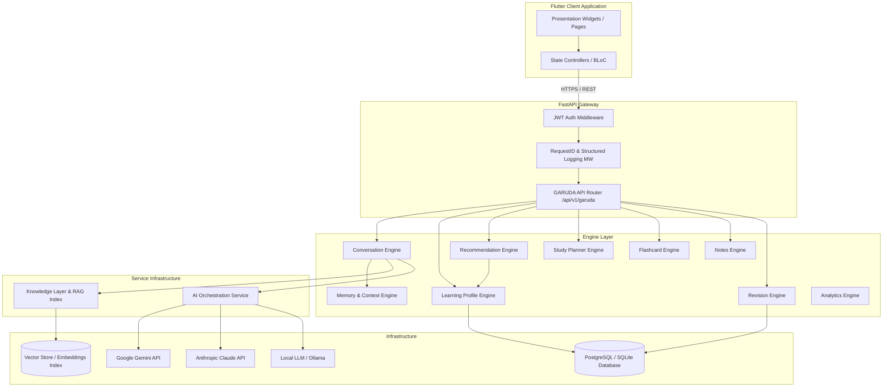
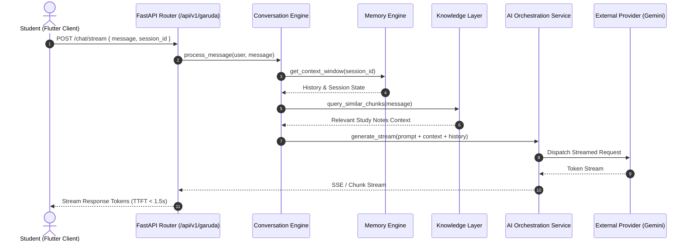

# GARUDA AI High-Level Architecture & Technical Specification

**Document Identifier:** TITAN-ARCH-GARUDA-V1.0  
**Status:** Approved Technical Design Blueprint  
**Sprint:** 7.0  
**Author:** Senior Solution Architect, Project TITAN  

---

## 1. Executive Summary

GARUDA AI is designed as a modular, decoupled intelligence framework for Project TITAN. It provides adaptive learning analytics, automated content generation, Socratic tutoring, and spaced repetition scheduling. The architecture strictly follows **Clean Architecture**, **SOLID principles**, and **Dependency Injection** to ensure zero tight-coupling with Flutter UI or underlying storage infrastructure.

---

## 2. Architectural Principles

1. **Clean Architecture (Layer Separation):** Domain models and business interfaces are pure and isolated from web frameworks or persistence libraries.
2. **SOLID Principles:** Single Responsibility per engine, Open/Closed for provider plugins, Interface Segregation, and Liskov Substitution across all repository interfaces.
3. **Interface-First Contract Design:** All engines communicate via abstract Python protocols / abstract base classes (`typing.Protocol` / `abc.ABC`).
4. **Dependency Injection (DI):** Dependencies are injected at app startup via factory providers.
5. **Decoupled Pluggability:** AI models (Gemini, Claude, Local LLMs) are swapped seamlessly behind a unified provider interface.

---

## 3. High-Level Architecture Diagram

---

## 4. Comprehensive Module Breakdown

GARUDA AI consists of 11 core sub-engines operating under clean interface boundaries:

### 4.1 AI Service Layer (`garuda.ai_service`)
- **Responsibility:** Multi-provider LLM orchestration, model fallback, prompt template injection, streaming token parser.
- **Contract:** `IAIServiceProvider` (methods: `generate_response()`, `stream_response()`, `count_tokens()`).

### 4.2 Knowledge Layer & RAG Engine (`garuda.knowledge`)
- **Responsibility:** Document chunking, embedding generation, vector similarity search, context retrieval.
- **Contract:** `IKnowledgeStore` (methods: `index_document()`, `query_similar_chunks()`, `delete_index()`).

### 4.3 Learning Profile Engine (`garuda.profile`)
- **Responsibility:** Computes real-time topic mastery scores, tracks cognitive accuracy, models Ebbinghaus retention curves.
- **Contract:** `ILearningProfileEngine` (methods: `get_user_profile()`, `update_mastery()`, `identify_weak_spots()`).

### 4.4 Recommendation Engine (`garuda.recommendation`)
- **Responsibility:** Next-best-action recommendation algorithms, prioritizing daily study/quiz tasks.
- **Contract:** `IRecommendationEngine` (methods: `generate_daily_recommendations()`, `rank_content()`).

### 4.5 Memory & Context Engine (`garuda.memory`)
- **Responsibility:** Conversation turn windowing, short-term session state, long-term entity/topic context extraction.
- **Contract:** `IMemoryEngine` (methods: `get_context_window()`, `append_turn()`, `summarize_session()`).

### 4.6 Conversation Engine (`garuda.conversation`)
- **Responsibility:** Multi-turn Socratic chat tutoring, query intent classification, response streaming.
- **Contract:** `IConversationEngine` (methods: `process_user_message()`, `stream_socratic_reply()`).

### 4.7 Analytics Engine (`garuda.analytics`)
- **Responsibility:** Computes historical performance trends, accuracy heatmaps, topic progression rates.
- **Contract:** `IGarudaAnalyticsEngine` (methods: `calculate_metrics()`, `export_insights()`).

### 4.8 Study Planner Engine (`garuda.planner`)
- **Responsibility:** Automated study calendar generation, daily workload balancing, target exam countdown scheduling.
- **Contract:** `IStudyPlannerEngine` (methods: `create_plan()`, `reschedule_overdue()`, `get_daily_schedule()`).

### 4.9 Flashcard Engine (`garuda.flashcard`)
- **Responsibility:** Automated flashcard extraction from text/PDFs, cloze deletion generation, SM-2 scheduling.
- **Contract:** `IFlashcardEngine` (methods: `generate_flashcards()`, `review_card()`, `get_due_cards()`).

### 4.10 Notes Engine (`garuda.notes`)
- **Responsibility:** Automated concept summarization, key term index extraction, structured markdown synthesis.
- **Contract:** `INotesEngine` (methods: `summarize_text()`, `extract_key_concepts()`).

### 4.11 Revision Engine (`garuda.revision`)
- **Responsibility:** Manages intelligent spaced repetition queues, error bank tracking, priority scoring.
- **Contract:** `IRevisionEngine` (methods: `get_revision_queue()`, `record_revision_attempt()`).

---

## 5. Integration Strategy with Existing Systems

### 5.1 Quiz Engine Integration
- GARUDA AI integrates with the existing FastAPI quiz endpoints (`app.api.v1.quiz`) and Quiz Service (`app.services.quiz_generation_service`).
- GARUDA's Flashcard and Revision engines accept generated quiz output schemas and update mastery metrics seamlessly.

### 5.2 Authentication Integration
- GARUDA endpoints reuse the existing JWT authentication module (`app.identity`).
- Routes are protected via `Depends(get_current_user)` dependencies, enforcing user identity isolation.

### 5.3 Observability Integration
- GARUDA request flows log through `app.core.logging.RequestIDAndLoggingMiddleware`.
- Every GARUDA response returns the standard `X-Request-ID` header and emits structured JSON logs.

---

## 6. API Route Specification (`/api/v1/garuda`)

| Method | Endpoint | Description | Request Body / Params |
|---|---|---|---|
| `POST` | `/api/v1/garuda/chat/stream` | Stream Socratic tutor response | `{ "message": str, "session_id": str }` |
| `GET` | `/api/v1/garuda/profile/mastery` | Retrieve user topic mastery | Query: `?subject=history` |
| `GET` | `/api/v1/garuda/recommendations` | Get prioritized daily task queue | Query: `?limit=5` |
| `POST` | `/api/v1/garuda/flashcards/generate`| Synthesize flashcards from text | `{ "content": str, "count": int }` |
| `GET` | `/api/v1/garuda/revision/queue` | Get due spaced repetition items | Query: `?category=weak` |
| `POST` | `/api/v1/garuda/planner/generate` | Generate dynamic study schedule | `{ "exam_date": str, "topics": [] }` |

---

## 7. Data Flow & Sequence Diagrams

### Socratic Conversation & RAG Retrieval Flow

---

## 8. Scalability, Security & Deployment Blueprint

1. **Stateless Service Scaling:** GARUDA engines hold no in-memory state across requests. Session state is retrieved from database/cache, allowing easy horizontal scaling behind Nginx.
2. **Reverse Proxy Integration:** Nginx handles ingress at `/api/v1/garuda`, supporting HTTP/2 streaming connections.
3. **Data Redaction:** Sensitive user data is sanitized prior to sending prompts to external APIs.
