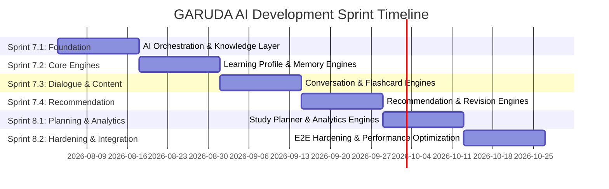

# GARUDA AI Module Development & Sprint Roadmap

**Document Identifier:** TITAN-ROADMAP-GARUDA-V1.0  
**Status:** Approved Implementation Roadmap  
**Sprint:** 7.0  
**Author:** Senior Solution Architect, Project TITAN  

---

## 1. Executive Summary

This document establishes the implementation phase breakdown, sub-module dependencies, risk management protocols, and sprint allocation for building **GARUDA AI** in Project TITAN.

---

## 2. Sprint Roadmap (Sprints 7.1 – 8.2)

### Sprint Breakdown Specifications

#### Sprint 7.1 — AI Orchestration & Knowledge Layer Foundation
- **Focus:** Build core `garuda.ai_service` provider interfaces (Gemini/Claude/Local) and RAG vector store indexing.
- **Deliverables:** Abstract provider contracts, prompt template manager, PDF/note chunker, semantic vector store interface.

#### Sprint 7.2 — Learning Profile & Memory Engine
- **Focus:** Build cognitive tracking algorithms and session memory context windows.
- **Deliverables:** Real-time topic mastery score calculator, retention decay model, session turn memory manager.

#### Sprint 7.3 — Conversation Engine & Content Synthesis
- **Focus:** Build Socratic multi-turn chat tutoring and automated flashcard/summary synthesis.
- **Deliverables:** Streaming chat endpoints (`/api/v1/garuda/chat/stream`), flashcard extractor, concept summarizer.

#### Sprint 7.4 — Recommendation & Intelligent Revision Engine
- **Focus:** Build Next-Best-Action recommendation engine and SM-2+ spaced repetition queue.
- **Deliverables:** `/api/v1/garuda/recommendations`, daily revision priority queueing.

#### Sprint 8.1 — Study Planner & Analytics Engine
- **Focus:** Build dynamic exam study calendar generator and performance analytics engine.
- **Deliverables:** Dynamic workload balancer, accuracy heatmaps, countdown scheduler.

#### Sprint 8.2 — E2E System Hardening & Performance Benchmarking
- **Focus:** End-to-end integration testing, token streaming optimization, load testing.
- **Deliverables:** <1.5s TTFT streaming benchmarks, >85% test coverage validation, production security signoff.

---

## 3. Module Dependencies Matrix

| Module | Dependent On | Downstream Consumers |
|---|---|---|
| **AI Service Layer** | None | Conversation, Flashcards, Notes |
| **Knowledge Layer (RAG)** | AI Service Layer | Conversation Engine |
| **Memory Engine** | None | Conversation Engine |
| **Learning Profile Engine** | Database Repositories | Recommendation Engine, Revision Engine |
| **Recommendation Engine** | Learning Profile Engine | Study Planner Engine, UI Dashboard |
| **Revision Engine** | Learning Profile Engine | Flashcards, Quiz Engine |
| **Conversation Engine** | AI Service, RAG, Memory | Client Socratic Chat UI |
| **Study Planner Engine** | Recommendation Engine | Client Calendar UI |

---

## 4. Risk Assessment & Mitigation Strategies

| Risk | Impact | Likelihood | Mitigation Strategy |
|---|---|---|---|
| **LLM Provider API Rate Limits (429)** | High | Medium | Implement automatic provider fallback (Gemini → Claude → Local) with exponential backoff. |
| **High Streaming Latency (>2s)** | Medium | Medium | Optimize prompt context length, enable HTTP/2 chunked streaming, pre-fetch user embeddings. |
| **Unbounded Session Memory Storage** | Medium | Low | Enforce sliding context window (max 10 turns) with periodic background summarization. |
| **Inaccurate Topic Mastery Calculation** | Low | Medium | Validate decay algorithms against empirical quiz attempt logs; run synthetic simulation benchmarks. |

---

## 5. Governance & Quality Acceptance Gates

Every sprint deliverable must satisfy:
1. **Zero Source Code Regressions:** Existing backend pytest suite and Flutter analysis must remain 100% green.
2. **Interface Isolation:** No concrete LLM SDKs imported directly inside core business domain layers.
3. **Pydantic Validation:** All REST request/response bodies strictly typed via Pydantic v2 schemas.
4. **Documentation:** OpenAPI/Swagger docs automatically generated for all `/api/v1/garuda` endpoints.
