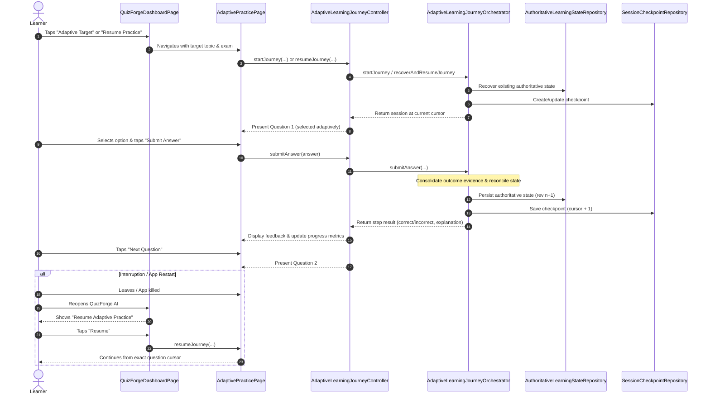

# P40 Runtime Integration Audit: Adaptive Learning $\to$ QuizForge AI

## 1. Executive Summary
This audit inspects the current codebase of QuizForge AI (`lib/`) and the core learning infrastructure in `packages/garuda_learning/` to identify reusable components, missing production wiring, and exact files required to make the end-to-end adaptive learning loop operational in the Flutter application.

---

## 2. Inventory of Existing Reusable Components

| Layer | Component | Location | Capability |
|---|---|---|---|
| **Domain & Engine** | `AdaptiveLearningJourneyOrchestrator` | `packages/garuda_learning/lib/service/adaptive_learning_journey_orchestrator.dart` | Complete orchestration: state recovery, question selection, practice execution, outcome consolidation, state reconciliation, checkpoint durability, and resumption. |
| **Presentation** | `AdaptiveLearningJourneyController` | `packages/garuda_learning/lib/adapter/adaptive_learning_journey_controller.dart` | UI controller managing session lifecycle (`startJourney`, `submitAnswer`, `interruptJourney`, `resumeJourney`), progress metrics, error states, and listener notifications. |
| **State Persistence** | `AuthoritativeLearningStateRecoveryService` | `packages/garuda_learning/lib/service/authoritative_learning_state_recovery_service.dart` | Recovers persisted learner state, validates checksum integrity, handles migration. |
| **Checkpoint Recovery** | `LearningSessionRecoveryService` | `packages/garuda_learning/lib/service/learning_session_recovery_service.dart` | Restores active session checkpoints with cursor and question order preservation. |
| **Progressive Mastery** | `ProgressiveMasteryEngine` | `packages/garuda_learning/lib/service/progressive_mastery_engine.dart` | Evaluates multi-topic mastery scores, confidence, weakest topics, and difficulty bands. |
| **Application Runtime** | `AdaptiveLearningRuntimeCoordinator` | `lib/services/adaptive_learning_runtime_coordinator.dart` | Bridges app runtime to authoritative persistence and mastery snapshot notifier. |
| **Question Bank** | `HivePyqRepository` / `PyqRepository` | `lib/repositories/impl/hive_pyq_repository.dart` | Official UPSC Prelims PYQ dataset loaded from assets/Hive. |
| **Model Adapter** | `NormalizedQuestion` | `packages/garuda_pyq/lib/multi_exam/multi_exam_pyq_intelligence.dart` | Canonical question representation for adaptive selection and assessment engines. |
| **Dashboard UI** | `QuizForgeDashboardPage` | `lib/pages/quizforge_dashboard_page.dart` | Main dashboard displaying metrics, quick actions, and recent activities. |

---

## 3. Missing Production Wiring & Disconnected Paths

1. **Disconnected Adaptive Target Tap**:
   - `DashboardController` successfully identifies `weakestTopics` and adds an `adaptive_rec_target` entry into `recentActivities`.
   - However, in `RecentActivityCardWidget`, the `ListTile` has no `onTap` handler. Tapping the adaptive recommendation does nothing.
2. **Missing Real-Time Adaptive Practice Screen**:
   - `QuizPage` is designed for batch exams (generate from PDF, answer offline, bulk submit at the end).
   - There is no UI screen wired to `AdaptiveLearningJourneyController` to step through questions one-by-one, display real-time result feedback, consolidate outcomes, advance authoritative revisions, and track progress.
3. **Question Corpus Bridge**:
   - `AdaptiveLearningJourneyOrchestrator` requires a `List<NormalizedQuestion> corpus`.
   - The application has `PyqRepository` with `PyqQuestionModel` objects, but no helper service mapping them into `NormalizedQuestion` candidates for adaptive selection.
4. **Session Checkpoint Resumption**:
   - The "Unfinished Quiz Found" card in `RecentActivityCardWidget` navigates to `HomePage` and only checks legacy `QuizSessionRepository`.
   - It does not check or resume authoritative `SessionCheckpointRepository` checkpoints managed by `LearningSessionRecoveryService`.

---

## 4. Exact User Workflow to Implement

---

## 5. Exact Files to Modify & Create

### Existing Files to Modify (Budget: $\le 3$ files)
1. [`lib/core/di/service_locator_init.dart`](file:///c:/Users/Abhinav%20Rajput/QuizForge-AI/lib/core/di/service_locator_init.dart):
   - Register `AdaptiveLearningJourneyOrchestrator` and `AdaptiveLearningJourneyController` in TITAN Service Locator.
2. [`lib/widgets/dashboard/recent_activity_card_widget.dart`](file:///c:/Users/Abhinav%20Rajput/QuizForge-AI/lib/widgets/dashboard/recent_activity_card_widget.dart):
   - Add `onActivityTap` callback to handle taps on adaptive recommendation targets.
3. [`lib/pages/quizforge_dashboard_page.dart`](file:///c:/Users/Abhinav%20Rajput/QuizForge-AI/lib/pages/quizforge_dashboard_page.dart):
   - Wire `onActivityTap` and "Resume" actions to launch the real `AdaptivePracticePage`.

### New Files to Create
1. [`lib/pages/adaptive_practice_page.dart`](file:///c:/Users/Abhinav%20Rajput/QuizForge-AI/lib/pages/adaptive_practice_page.dart):
   - Interactive Flutter UI presenting questions, option selection, step-by-step submission feedback, progress indicators, and session completion summary.
2. [`lib/services/pyq_corpus_adapter_service.dart`](file:///c:/Users/Abhinav%20Rajput/QuizForge-AI/lib/services/pyq_corpus_adapter_service.dart):
   - Bridges `PyqRepository` questions into canonical `NormalizedQuestion` corpus for adaptive selection.
3. [`test/integration/p40_adaptive_learning_flow_test.dart`](file:///c:/Users/Abhinav%20Rajput/QuizForge-AI/test/integration/p40_adaptive_learning_flow_test.dart):
   - Comprehensive end-to-end integration tests verifying all 12 required scenarios.

---

## 6. Obsolete/Duplicate Paths to Avoid
- **DO NOT** create a second question selection engine (reuse `AdaptiveQuestionSelectionService`).
- **DO NOT** recreate practice execution logic (reuse `AdaptivePracticeExecutionEngine` and `ResumableAdaptivePracticeCoordinator`).
- **DO NOT** create duplicate outcome consolidation (reuse `PracticeOutcomeConsolidator`).
- **DO NOT** create a duplicate state reconciliation pipeline (reuse `AdaptiveLearningStateReconciliationPipeline`).
- **DO NOT** build fake state mocks in production code; all updates must flow into real `AuthoritativeLearnerStateRepository`.
