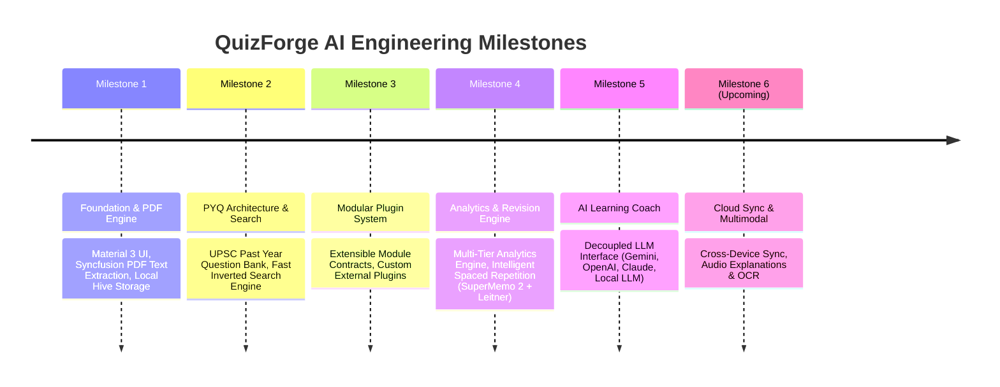

# QuizForge AI Product & Engineering Roadmap

This document outlines the completed milestones, current engineering focus, upcoming sprints, and release strategies for **QuizForge AI**.

---

## 1. Executive Summary & Status

QuizForge AI is a data-driven, offline-first UPSC Civil Services preparation platform. It has evolved from a PDF quiz generator into an intelligent AI learning platform featuring spaced repetition revision, performance analytics, and multi-provider AI learning coaching.

---

## 2. Milestone Overview

---

## 3. Detailed Milestone Status

### ✅ Milestone 1: Core Foundation & PDF Generator (Completed - v1.0.0)
- Material 3 Responsive Dark/Light Palette & Custom Theme Tokens.
- PDF Document Text Extraction via `syncfusion_flutter_pdf`.
- Gemini REST API integration for UPSC question generation.
- Dynamic UPSC Timer & Quiz Session State Machine.

### ✅ Milestone 2: PYQ Architecture & Search Engine (Completed - v1.1.0)
- Standardized `PyqQuestionModel` with stable IDs and multi-source explanations (`PyqExplanation`).
- Inverted index search engine (`PyqSearchEngine`) supporting full-text query, year, subject, topic, and difficulty filtering.
- PDF Library Management & local storage.

### ✅ Milestone 3: Plugin Architecture & Extensibility (Completed - v1.2.0)
- Five standard plugin interface contracts (`BaseModule`, `ModuleRepository`, `ModuleImporter`, `ModuleAnalytics`, `ModuleUI`).
- `ModuleRegistry` supporting runtime dynamic plugin registration and third-party extensions without core engine modification.

### ✅ Milestone 4: Analytics & Spaced Repetition Revision (Completed - v1.3.0)
- Comprehensive `AnalyticsEngine` tracking 17 learning metrics (Accuracy, Streaks, Time/Question, Question Attempt Frequency, Subject/Topic/Year Breakdown).
- `AnalyticsExporter` supporting JSON, CSV, and printable Text report exports.
- Intelligent Revision Engine (`RevisionStrategy` & `AdaptiveRevisionStrategy`) using 6 inputs (Difficulty, Last Attempt, Correctness, Time Taken, Bookmark, Confidence Level).
- `PyqSmartRevisionPage` with 4 revision queues (Today, Overdue, Bookmarked, Weak Topic), Revision Calendar, and Smart Recommendations.

### ✅ Milestone 5: AI Learning Coach & Decoupled LLM (Completed - v1.4.0)
- Decoupled `LearningCoach` abstract interface.
- Implementations for `GeminiLearningCoach`, `OpenAiLearningCoach`, `ClaudeLearningCoach`, `LocalLlmLearningCoach`.
- `LearningCoachFactory` for dynamic runtime provider switching.
- 6 Coach Features: Weekly report, Weak topics breakdown, Recommended PYQs, Recommended AI quizzes, Study hours allocation, Motivational insights.
- Long-term Engineering Documentation suite in `docs/`.

---

## 4. Upcoming Sprints & Future Milestones

### 🚀 Sprint 6: Cloud Sync & Multimodal Integration (Target: v1.5.0)
- **Cross-Device Cloud Sync**: Optional end-to-end encrypted backup/restore for progress, bookmarks, and revision schedules.
- **Multimodal Question Processing**: OCR image text extraction for diagrams and map-based UPSC questions.
- **Audio Learning Coach**: Voice readout for explanations and mnemonics.

### 🚀 Sprint 7: Community Question Packs & Custom Exams (Target: v2.0.0)
- **Community Package Hub**: Import custom JSON question packages from top coaching institutes.
- **Custom Exam Constructor**: Create combined Mains & Prelims test series with custom timers and marking schemes.
- **Advanced Knowledge Graph UI**: Interactive 2D/3D visual map of subject concept dependencies.

---

## 5. Release Strategy & Versioning

QuizForge AI strictly enforces **Semantic Versioning (MAJOR.MINOR.PATCH)**:
- **MAJOR**: Breaking schema changes or major architectural overhauls.
- **MINOR**: New feature additions, new AI providers, or strategy additions (backward-compatible).
- **PATCH**: Bug fixes, performance tweaks, or documentation updates.

### Quality Assurance Gates for Release
1. `dart format .` execution across all codebase files.
2. `flutter analyze` returning `No issues found! (0 errors, 0 warnings)`.
3. `flutter test` passing 100% of automated unit and integration tests.
