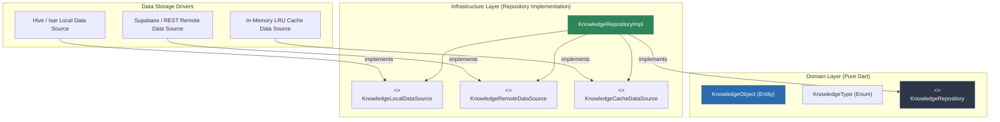
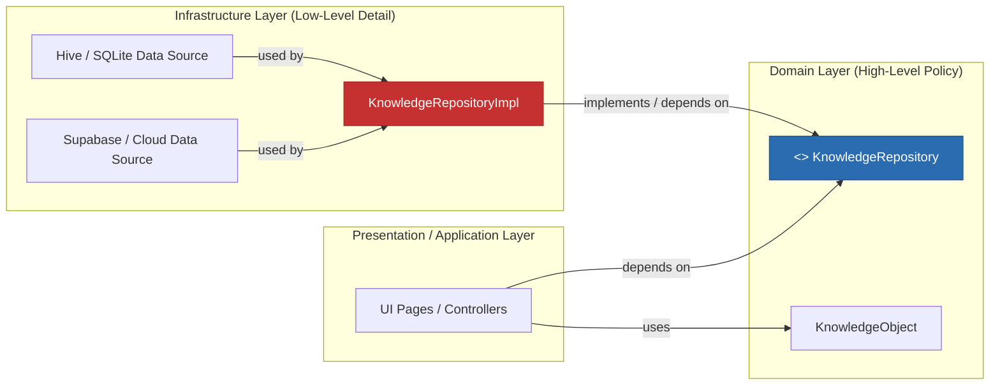
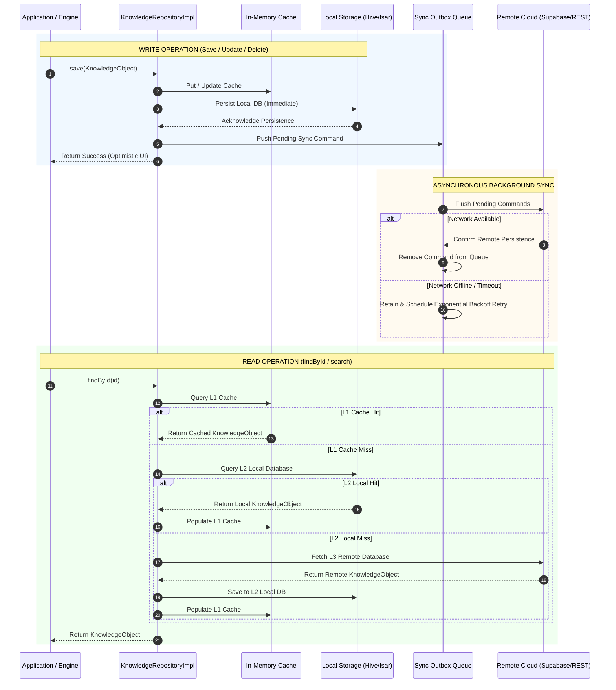

# Project TITAN Architecture Design Document

## Document Metadata
- **Sprint**: Sprint 1.1
- **Task ID**: TITAN-KIE-002A
- **Feature**: Repository Strategy & Storage Architecture
- **Module**: Knowledge Intelligence Engine (`knowledge_engine`)
- **Type**: Architectural Design Specification
- **Status**: Accepted (TDL-005)
- **Date**: 2026-07-22

---

## Decision Record: TDL-005

| Decision ID | Decision | Reason | Impact | Status |
| :--- | :--- | :--- | :--- | :--- |
| **TDL-005** | Introduce a layered, pluggable Repository Strategy before implementing storage. | Decouple domain logic from concrete database/storage providers; enable offline-first capabilities and future multi-provider migration without modifying business rules. | **High** | **Accepted** |

---

## 1. Executive Summary & Goals

Project TITAN introduces a unified Knowledge Layer across all intelligent engines (Knowledge Intelligence Engine, Current Affairs, PYQs, Learning Memory, Recommendation Engine, AI Mentor). Every engine communicates exclusively through the **Canonical Knowledge Object (CKO)** (`KnowledgeObject`).

The objective of this Repository Strategy is to establish a **Clean Architecture Repository Pattern** that decouples domain entities and business use cases from concrete persistence mechanisms (Hive, Isar, SQLite, Supabase, Firebase, REST APIs, or memory caches).

### Key Architectural Principles
- **Clean Architecture & SOLID**: Strict isolation between Domain, Application, Infrastructure, and Presentation layers.
- **Dependency Inversion Principle (DIP)**: High-level domain modules depend on abstract repository interfaces (`KnowledgeRepository`), not low-level storage drivers.
- **Offline-First Primary Constraint**: All write and query operations prioritize immediate local execution and queue asynchronous remote background sync.
- **Pluggable Engine Adapter Pattern**: Storage providers can be added, replaced, or swapped via Dependency Injection without changing a single line of domain code.

---

## 2. Layered Repository Architecture

The repository architecture is organized into three distinct structural layers:

```
┌──────────────────────────────────────────────────────────────────┐
│                          DOMAIN LAYER                            │
│  - KnowledgeObject (Immutable Entity)                            │
│  - KnowledgeType (Value Object Enum)                             │
│  - KnowledgeRepository (Abstract Contract Interface)            │
└─────────────────────────────────▲────────────────────────────────┘
                                  │ Directs Implementation
┌─────────────────────────────────┴────────────────────────────────┐
│                   REPOSITORY IMPLEMENTATION LAYER                │
│  - KnowledgeRepositoryImpl (Orchestrator)                        │
│  - Cache / Local / Remote Coordination                           │
│  - Offline Sync Queue & Conflict Resolution Strategy             │
└───────┬─────────────────────────┬────────────────────────┬───────┘
        │                         │                        │
┌───────▼────────┐       ┌────────▼───────┐       ┌────────▼───────┐
│  CACHE ENGINE  │       │  LOCAL ENGINE  │       │ REMOTE ENGINE  │
│  (In-Memory)   │       │ (Hive / Isar)  │       │ (Supabase/REST)│
└────────────────┘       └────────────────┘       └────────────────┘
```

### Layer Responsibilities

| Layer | Responsibility | Allowed Dependencies | Prohibited Dependencies |
| :--- | :--- | :--- | :--- |
| **Domain Layer** | Defines entities (`KnowledgeObject`), value objects (`KnowledgeType`), and contract interfaces (`KnowledgeRepository`). | Dart Standard Library, `meta` package. | UI, Storage SDKs (Hive/Isar/Supabase), HTTP clients, Flutter UI framework. |
| **Repository Implementation Layer** | Implements `KnowledgeRepository`, orchestrates data sources (Local, Remote, Cache), handles caching policies, offline outbox queuing, and conflict resolution. | Domain Layer, Data Source Interfaces. | UI framework, direct low-level SDK instances. |
| **Data Source Infrastructure Layer** | Implements low-level data access adapters (`HiveLocalDataSource`, `SupabaseRemoteDataSource`, `InMemoryCacheDataSource`), map raw DTOs to entities. | Database SDKs (`hive`, `isar`, `supabase_flutter`), HTTP clients. | Business logic, UI components. |

---

## 3. Required Diagrams

### Diagram 1: Repository Layer Architecture



---

### Diagram 2: Dependency Flow (Dependency Inversion Principle)



---

### Diagram 3: Offline-First Data Flow



---

### Diagram 4: Future Multi-Repository Architecture

```mermaid
graph TD
    subgraph "Domain Layer"
        CKO["KnowledgeObject (CKO)"]
        KRP["KnowledgeRepository"]
    end

    subgraph "Repository Orchestrator"
        KRI["KnowledgeRepositoryImpl (Composite Orchestrator)"]
    end

    subgraph "Pluggable Storage Adapters"
        HIVE["Hive Local Adapter"]
        ISAR["Isar Local Adapter"]
        SQL["SQLite Local Adapter"]
        SUPA["Supabase Cloud Adapter"]
        FIRE["Firebase Cloud Adapter"]
        REST["Custom REST API Adapter"]
    end

    KRP <|.. KRI
    KRI --> HIVE
    KRI --> ISAR
    KRI --> SQL
    KRI --> SUPA
    KRI --> FIRE
    KRI --> REST

    style CKO fill:#2b6cb0,stroke:#2c5282,color:#fff
    style KRP fill:#2d3748,stroke:#4a5568,color:#fff
    style KRI fill:#2f855a,stroke:#276749,color:#fff
```

---

## 4. Data Flow Specifications

### 4.1 Write Execution Pathway
1. **Optimistic Execution**: Write requests (`save`, `update`, `delete`) are committed immediately to the L1 In-Memory Cache and L2 Local Database.
2. **Instant UI Resolution**: The repository returns success immediately to the calling application/engine, ensuring zero latency UI response.
3. **Outbox Enqueue**: A transaction command object (`SyncCommand`) containing entity ID, operation type (`CREATE`, `UPDATE`, `DELETE`), payload, and timestamp is appended to an atomic Outbox Queue in local storage.
4. **Asynchronous Background Processing**: A background worker picks up queued commands and pushes them to the Remote Data Source. Upon successful remote HTTP 2xx acknowledgement, the command is removed from the queue.

### 4.2 Read Execution Pathway
1. **L1 (In-Memory LRU Cache)**: Checked first for ultra-fast, zero-IO retrieval.
2. **L2 (Local Disk Storage)**: Checked on L1 cache miss. On L2 hit, L1 cache is populated and result is returned.
3. **L3 (Remote Cloud API)**: Checked on L2 miss (or during explicit refresh synchronization). Fetched remote entities are persisted down to L2 and L1 before returning to the caller.

---

## 5. Proposed Contract Interfaces

The infrastructure implementation layer will rely on the following interface abstractions:

```dart
/// Contract for local database storage engines (Hive, Isar, SQLite).
abstract class KnowledgeLocalDataSource {
  Future<void> save(KnowledgeObject object);
  Future<void> update(KnowledgeObject object);
  Future<void> delete(String id);
  Future<KnowledgeObject?> findById(String id);
  Future<List<KnowledgeObject>> search(String query);
  Future<List<KnowledgeObject>> getAll();
  Future<void> clear();
}

/// Contract for remote cloud persistence engines (Supabase, Firebase, REST API).
abstract class KnowledgeRemoteDataSource {
  Future<void> save(KnowledgeObject object);
  Future<void> update(KnowledgeObject object);
  Future<void> delete(String id);
  Future<KnowledgeObject?> findById(String id);
  Future<List<KnowledgeObject>> search(String query);
  Future<List<KnowledgeObject>> fetchUpdatedSince(DateTime timestamp);
}

/// Contract for ultra-fast in-memory caching.
abstract class KnowledgeCacheDataSource {
  KnowledgeObject? get(String id);
  void put(KnowledgeObject object);
  void remove(String id);
  void clear();
}
```

---

## 6. Caching & Sync Strategies

### 6.1 Multi-Tier Caching Rules
- **L1 Cache TTL**: 15 minutes default expiry per entry.
- **Cache Invalidation**:
  - Direct local writes or updates immediately invalidate and update corresponding L1 entries.
  - Manual sync or full pull operations flush L1 cache to ensure consistency.

### 6.2 Offline-First Synchronization & Outbox Queue
- **Write-Ahead Log (WAL)**: All offline mutations are written to a persistent Hive/SQLite outbox store prior to attempting network synchronization.
- **Exponential Backoff Retry**: Network failures trigger retries with exponential backoff (`delay = initialInterval * 2^retryCount`, capped at 5 minutes).
- **Network Awareness**: Listens to connectivity changes (via connectivity listeners) to flush outbox queue immediately when connectivity is restored.

### 6.3 Conflict Resolution Policy
- **Primary Policy: Last-Write-Wins (LWW)**: Timestamps (`updatedAt`) are compared during synchronization. The entity with the more recent `updatedAt` value overwrites the older entity.
- **Deterministic Field Merging**: For non-conflicting field updates, metadata payloads are merged deterministically.
- **Server Authority Fallback**: In administrative or critical domain operations, remote server timestamp overrides client timestamp if drift exceeds a configured threshold (e.g., 5 minutes).

---

## 7. Future Extensibility & Recommendations

1. **Dependency Injection**: Bind repository abstractions via a service locator (e.g. `GetIt`) or provider package:
   ```dart
   // Example DI registration pattern for Sprint 1.2 / TITAN-KIE-002B
   sl.registerLazySingleton<KnowledgeLocalDataSource>(() => HiveLocalDataSource());
   sl.registerLazySingleton<KnowledgeRemoteDataSource>(() => SupabaseRemoteDataSource());
   sl.registerLazySingleton<KnowledgeRepository>(
     () => KnowledgeRepositoryImpl(
       localDataSource: sl(),
       remoteDataSource: sl(),
       cacheDataSource: sl(),
     ),
   );
   ```
2. **Zero Domain Modification Guarantee**: Future storage drivers (e.g., migrating from Hive to Isar or REST to Supabase) will only require adding a new Data Source implementation. The `KnowledgeRepository` interface, `KnowledgeObject` entity, and all consuming engines will remain untouched.

---

## 8. Verification Checklist for Upcoming Implementation Sprints

- [x] Architecture design document completed and placed in `docs/architecture/`.
- [x] Repository Layer boundaries clearly defined.
- [x] 4 Mermaid diagrams provided (Layer Architecture, Dependency Flow, Offline Data Flow, Multi-Repository Support).
- [x] Conflict resolution and caching policies documented.
- [x] Zero production code changed, zero dependencies added, zero existing logic affected.
