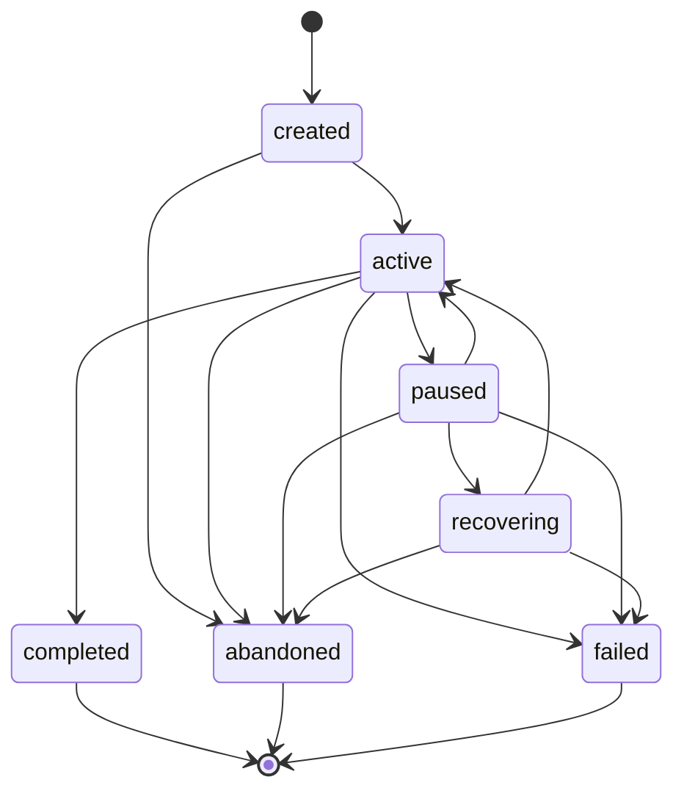

# P40 — Adaptive Learning Session Lifecycle & Recovery Continuation

## 1. Architectural Overview & Context

In Project TITAN, **QuizForge AI / GARUDA Learning** provides enterprise-grade adaptive learning for high-stakes competitive examinations (e.g., UPSC, BPSC, SSC). Prior milestones established question normalization (P31), learning priorities (P32), question selection (P33), practice orchestration (P34), execution (P35), outcome consolidation (P36), state reconciliation (P38), and authoritative state persistence & recovery (P39).

**P40 — Adaptive Learning Session Lifecycle & Recovery Continuation** unifies these components into an end-to-end, lifecycle-managed, recoverable session engine. It guarantees that an adaptive session can be started, progressed through questions, interrupted (or crashed), recovered, resumed at the exact uncompleted question, and finalized with absolute revision monotonicity, idempotency, and strict multi-tenant isolation.

```text
Practice
  ↓
Outcome Consolidation
  ↓
State Reconciliation
  ↓
Authoritative Learner State Persistence
  ↓
Session Checkpointing
  ↓
Crash / Interruption
  ↓
Recovery & Monotonic Resumption
  ↓
Completion Ordering Guarantee
```

---

## 2. Lifecycle State Machine (`SessionStatus`)

Adaptive learning sessions transition through a strict, deterministic finite state machine defined in `SessionStatus`:



### State Semantics:
- **`created`**: Initial initialized state. Configuration verified, questions selected, but first question not yet delivered.
- **`active`**: Currently executing. Accepts question attempts, delivers questions, allows pauses.
- **`paused`**: Gracefully paused by learner or system. Execution suspended; can transition to `active` or `recovering`.
- **`recovering`**: Transient recovery state while verifying checkpoint integrity and reconciling authoritative learner state.
- **`completed`**: Terminal state. All scheduled questions attempted or session gracefully concluded. Immutable and locked.
- **`abandoned`**: Terminal state. Learner aborted session prematurely or session expired. Immutable and locked.
- **`failed`**: Terminal state. Fatal corruption or invariant violation encountered. Immutable and locked.

---

## 3. Core Domain Models

### 3.1 `AdaptiveLearningSession`
Immutable aggregate root representing the complete session lifecycle:
- **`sessionId`**, **`learnerId`**, **`examId`**: Tenant and session coordinates.
- **`currentQuestionPosition`**: 0-based index of the currently active question.
- **`completedQuestions`**: Immutable list of answered question IDs preserving lineage.
- **`currentLearningStateRevision`**: Revision sequence of the underlying authoritative learner state.
- **`checkpointRevision`**: Monotonic revision counter for persisted session snapshots.
- **`configuration`**: `AdaptivePracticeSessionConfig` defining exam, target question counts, pacing, and modes.
- **`completionMetadata`**: Audit and telemetry metadata recorded upon session finalization.

### 3.2 `SessionCheckpoint`
Durable point-in-time snapshot persisted after every attempt, pause, and resumption:
- Captures `questionIndex`, `completedQuestionIds`, `activeObjectiveId`, `timestamp`, and `isCompleted`.
- Carries dual revision numbers (`checkpointRevision` and `authoritativeStateRevision`).

### 3.3 `SessionRecoveryResult`
Strongly-typed recovery envelope returned by `recoverSession`:
- Success returns reconstructed `ResumableLearningSession`, `AuthoritativeLearnerState`, and `SessionCheckpoint`.
- Failure cases return explicit `SessionRecoveryErrorCode` values (`coldStart`, `alreadyCompleted`, `notRecoverable`, `identityMismatch`, `corruptedCheckpoint`, `staleCheckpoint`).

---

## 4. Repository Abstraction Layer

Clean Architecture repository contract decoupled from underlying database implementations:

### `AdaptiveLearningSessionRepository`
```dart
abstract class AdaptiveLearningSessionRepository {
  Future<AdaptiveLearningSession> createSession(AdaptiveLearningSession session);
  Future<AdaptiveLearningSession?> getSession({
    required String learnerId,
    required String examId,
    required String sessionId,
  });
  Future<AdaptiveLearningSession> updateSession(AdaptiveLearningSession session);
  Future<void> saveCheckpoint(SessionCheckpoint checkpoint);
  Future<SessionCheckpoint?> getLatestCheckpoint({
    required String learnerId,
    required String examId,
    required String sessionId,
  });
  Future<List<SessionCheckpoint>> getCheckpointHistory({
    required String learnerId,
    required String examId,
    required String sessionId,
  });
  Future<AdaptiveLearningSession> markCompleted({
    required String learnerId,
    required String examId,
    required String sessionId,
    DateTime? completedAt,
    Map<String, dynamic>? completionMetadata,
  });
  Future<AdaptiveLearningSession> markAbandoned({
    required String learnerId,
    required String examId,
    required String sessionId,
    DateTime? abandonedAt,
    String? reason,
  });
}
```

### `InMemoryAdaptiveLearningSessionRepository`
- Production reference and test harness implementation.
- Keys sessions and checkpoints by composite tenant key `$learnerId:$examId:$sessionId`.
- Enforces strict monotonic revision progression on `saveCheckpoint` (rejecting stale revisions $\le$ current revision, while allowing idempotent identical saves).

---

## 5. Production Orchestration Engine

`AdaptiveLearningSessionOrchestrator` unifies question selection, evaluation, state reconciliation, persistence, and recovery:

1. **`startSession`**:
   - Reconciles or loads base authoritative state via `AuthoritativeLearningStateRecoveryService`.
   - Selects adaptive questions from corpus via `AdaptiveQuestionSelectionService` using learner weak spots and PYQ priorities.
   - Instantiates `AdaptiveLearningSession` in `active` state and saves initial checkpoint at revision 1.

2. **`getNextQuestion`**:
   - Validates tenant ownership and checks session completion status.
   - Delivers next uncompleted question at current cursor position.
   - Throws `CompletedSessionMutationException` if session is completed.

3. **`recordAttempt`**:
   - **Deduplication Guard**: Checks if `questionId` was already answered; throws `DuplicateAttemptException` if duplicate.
   - Evaluates answer correctness against `question.officialAnswer`.
   - Updates authoritative learner state and saves to `AuthoritativeLearningStateRepository` with incremented revision.
   - Advances session cursor and completed question lineage.
   - Generates and persists new `SessionCheckpoint` at incremented revision.
   - Auto-completes session if all planned questions are completed.

4. **`pauseSession`**:
   - Transitions session to `paused` state and saves durable checkpoint snapshot.

5. **`recoverSession`**:
   - Validates multi-tenant boundaries.
   - Loads latest checkpoint from repository; returns typed failure (`coldStart`, `alreadyCompleted`, `notRecoverable`, `staleCheckpoint`) if invalid.
   - Verifies monotonic revision consistency against recovered authoritative learner state.
   - Reconstructs `ResumableLearningSession`.

6. **`resumeSession`**:
   - Executes `recoverSession`.
   - Transitions session to `active` state.
   - Saves resumed checkpoint snapshot at incremented revision.

7. **`completeSession`** (Strict Persistence Ordering Guarantee):
   - Incorporates `sessionId` into authoritative learner state's `processedSessionIds` and saves with incremented revision.
   - Persists final `SessionCheckpoint` marked `isCompleted: true`.
   - Marks session status as `completed` in `AdaptiveLearningSessionRepository`.
   - Idempotent: subsequent calls return existing completed session.

---

## 6. Typed Domain Exceptions

All lifecycle, validation, and recovery errors throw strongly-typed subclasses of `SessionCheckpointException`:
- `SessionNotFoundException`: Session ID does not exist in the repository partition.
- `InvalidSessionTransitionException`: Illegal lifecycle transition (e.g. `completed` -> `active`).
- `SessionOwnershipException`: Access attempted across different learner or examination partitions.
- `CompletedSessionMutationException`: Attempt or question delivery requested on a completed session.
- `DuplicateAttemptException`: Attempt submitted for an already answered question.

---

## 7. Verification & Test Coverage

### Automated Test Suites:
1. `packages/garuda_learning/test/p40_adaptive_learning_session_test.dart`
   - Unit tests for `SessionStatus` transition graph.
   - Unit tests for `AdaptiveLearningSession` immutability and copyWith/transition logic.
   - Unit tests for `InMemoryAdaptiveLearningSessionRepository` revision monotonicity and isolation.
2. `packages/garuda_learning/test/integration/p40_adaptive_learning_session_orchestrator_integration_test.dart`
   - End-to-end crash-safe lifecycle: Start -> Answer Q0 -> Pause -> Crash -> Recover -> Resume -> Answer Q1 -> Auto-Complete.
   - Deduplication guard verification.
   - Strict multi-tenant isolation across learners and examinations.
   - Terminal session mutation rejection.
3. `packages/garuda_learning/test/integration/p40_learning_session_recovery_integration_test.dart`
   - Offline crash-recovery lifecycle with memory wipe and resumption.
4. `packages/garuda_learning/test/integration/p40_session_resume_integration_test.dart`
   - 20-step adaptive lifecycle and legacy checkpoint schema migration.

All 15 unit and integration tests pass with zero failures and zero analyzer issues.
