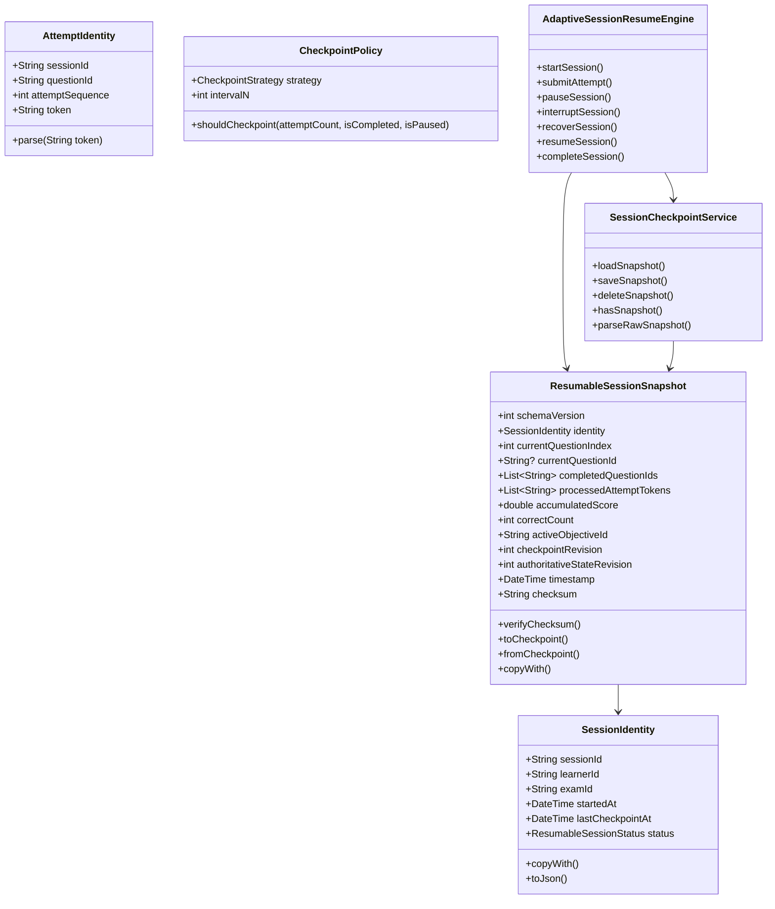
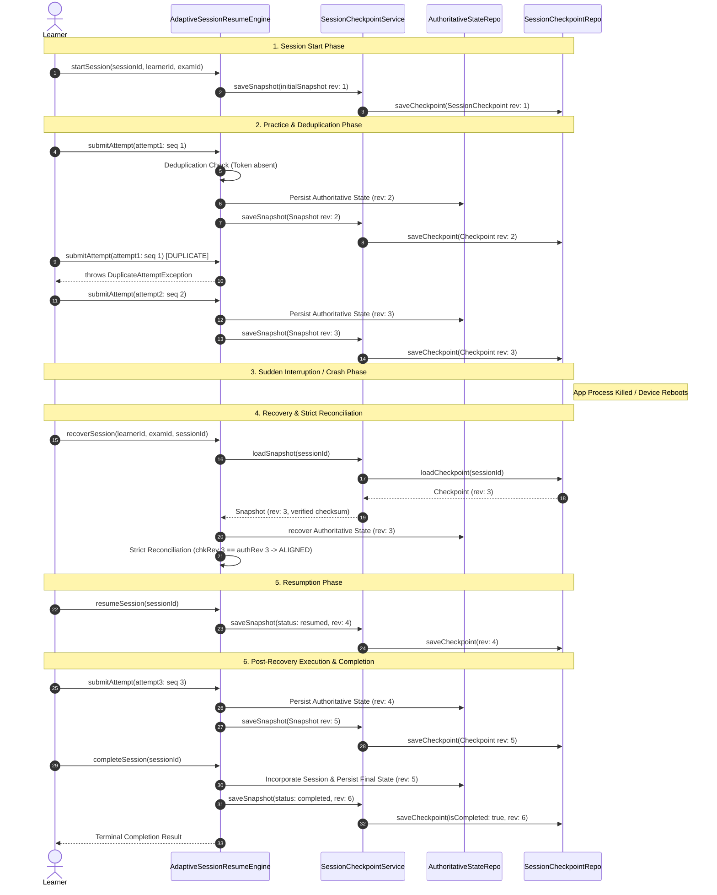

# P40 — Adaptive Learning State Lifecycle & Resume Engine Architecture

## 1. Executive Summary

The **Adaptive Learning State Lifecycle & Resume Engine** (Milestone **P40**) provides an enterprise-grade, crash-safe, deterministic state lifecycle and session resumption framework for adaptive learning practice within **QuizForge AI / Project TITAN**.

In mobile, web, and distributed environments, learning sessions face frequent interruptions—such as network loss, background process killing, device battery death, and sudden client restarts. Without strict transactional semantics and durable checkpointing, interrupted sessions risk progression corruption, duplicated question attempts, inconsistent learner analytics, and fractured objective mastery tracking.

P40 solves this with:
1. **Durable Session Identity**: Immutable coordinate anchoring (`sessionId`, `learnerId`, `examId`, `startedAt`, `lastCheckpointAt`, `status`).
2. **Deterministic Attempt Deduplication**: Per-attempt tokens (`${sessionId}:${questionId}:${attemptSequence}`) preventing double-counting or replaying attempts across interruptions.
3. **Cryptographic Payload Verification**: Canonical JSON serialization guarded by SHA-256 integrity checksums against storage bitrot and tampering.
4. **Strict Monotonic Revision Control**: Monotonically increasing checkpoint revisions rejected if stale (`chkRev < existingRev`) or diverging on identical revisions.
5. **Multi-Version Schema Evolution**: Seamless upward migration from legacy unversioned schemas (`v0`) to current versioned snapshots (`v1`) with downgrade rejection.
6. **Strict Revision Alignment**: Runtime classification and reconciliation between checkpoint revisions (`chkRev`) and authoritative state revisions (`authRev`):
   - `chkRev < authRev`: Stale checkpoint (authoritative state advanced beyond session cursor).
   - `chkRev == authRev`: Fully synchronized and aligned.
   - `chkRev > authRev`: Checkpoint ahead of authoritative persistence (unpersisted practice state).
7. **Completion Ordering Guarantee**: Strict sequential commitment (`submitAttempt -> consolidateOutcome -> reconcileAuthoritativeState -> persistAuthoritativeState -> saveFinalCheckpoint -> markCompleted`).

---

## 2. Core Domain Model & Entity Architecture



### 2.1 SessionIdentity
Represents immutable session coordinates:
- `sessionId`: Target session identifier.
- `learnerId`: Isolated learner identifier.
- `examId`: Isolated examination identifier (normalized lowercase).
- `startedAt`: Immutable session initialization timestamp.
- `lastCheckpointAt`: Monotonically updated timestamp of the most recent checkpoint.
- `status`: Discrete lifecycle phase governed by `ResumableSessionStatus`.

### 2.2 AttemptIdentity & Deduplication Tokens
Deterministic attempt coordination token preventing replay attacks or re-submissions:
$$\text{token} = \text{sessionId} \mathbin{\Vert} \text{":"} \mathbin{\Vert} \text{questionId} \mathbin{\Vert} \text{":"} \mathbin{\Vert} \text{attemptSequence}$$
Any attempt submission bearing an already-processed token triggers an immediate, unhandled `DuplicateAttemptException`.

### 2.3 ResumableSessionSnapshot
Complete, durable representation of an interrupted adaptive session:
- Tracks `currentQuestionIndex`, `completedQuestionIds`, and `processedAttemptTokens`.
- Records `accumulatedScore`, `correctCount`, and `activeObjectiveId`.
- Preserves dual revision coordinates: `checkpointRevision` and `authoritativeStateRevision`.
- Embeds SHA-256 canonical payload checksum.

### 2.4 CheckpointPolicy
Flexible persistence strategies:
- `everyAttempt`: Highest durability; checkpoints after every single question attempt.
- `everyNAttempts(N)`: Periodic batching; checkpoints every $N$ attempts.
- `onPauseOrComplete`: Checkpoints exclusively on session pause or terminal completion.
- `manual`: Programmatic control via explicit caller request.

---

## 3. End-to-End 20-Step Lifecycle Architecture

The following diagram illustrates the complete 20-step lifecycle spanning execution, deduplication, sudden process crash, and seamless resumption:



---

## 4. Strict Revision Reconciliation Matrix

During recovery, `AdaptiveSessionResumeEngine` evaluates the relationship between the checkpoint revision ($R_{\text{chk}}$) and the authoritative state revision ($R_{\text{auth}}$):

| Condition | Alignment Category | System Behavior & Diagnostics |
|---|---|---|
| $R_{\text{chk}} == R_{\text{auth}}$ | `CheckpointReconciliationAlignment.aligned` | Clean, fully synchronized state. Practice session immediately ready to resume from cursor without adjustment. |
| $R_{\text{chk}} < R_{\text{auth}}$ | `CheckpointReconciliationAlignment.staleCheckpoint` | Stale checkpoint detected. Authoritative state contains progress or session updates newer than the checkpoint snapshot. Warning issued; state recovered for alignment. |
| $R_{\text{chk}} > R_{\text{auth}}$ | `CheckpointReconciliationAlignment.aheadOfAuthoritativeState` | Checkpoint is ahead of persisted authoritative state. Indicates transient practice execution occurred before state persistence completed or IO write failed during authoritative save. Diagnostics flagged for consistency audit. |

---

## 5. Schema Evolution & Migration Bridge

To ensure backward compatibility with earlier iterations and legacy schemas:
- **`v0` Legacy Checkpoints**: Payloads lacking explicit `schemaVersion`, lacking SHA-256 checksums, or using legacy `questionIndex` and unnested coordinate schemas.
- **`v1` Current Snapshots**: Production-grade snapshots carrying explicit `schemaVersion: 1`, cryptographic SHA-256 checksum, nested `SessionIdentity`, deduplication token history, and objective progress coordinates.

The `SessionCheckpointSchemaMigrator` interface provides deterministic schema upgrades:
```dart
abstract interface class SessionCheckpointSchemaMigrator {
  bool canMigrate(int sourceVersion, int targetVersion);
  ResumableSessionSnapshot migrate(
    Map<String, dynamic> rawJson, {
    required int sourceVersion,
    int targetVersion = ResumableSessionSnapshot.currentSchemaVersion,
  });
}
```

Rules:
1. Upgrading from `v0` to `v1` is deterministically supported.
2. Schema downgrades ($V_{\text{target}} < V_{\text{source}}$) are strictly rejected with `CheckpointSchemaException`.
3. Future unsupported schemas ($V_{\text{target}} > 1$) are rejected with `CheckpointSchemaException`.

---

## 6. Typed Exception Hierarchy

All failure modes in P40 are mapped to a structured, typed hierarchy inheriting from `SessionCheckpointException` / `SessionRecoveryException`:

```
SessionRecoveryException
  └── SessionCheckpointException
        ├── SessionIdentityMismatchException (expected vs actual tenant mismatch)
        ├── StaleCheckpointException (incomingRevision <= existingRevision conflict)
        ├── CheckpointIntegrityException (checksum mismatch / payload corruption)
        ├── CheckpointSchemaException (unsupported or downgrade schema version)
        ├── DuplicateAttemptException (repeated attempt token submission)
        └── SessionCompletionException (illegal transition on terminal session)
```

---

## 7. Verification & Quality Gates

The P40 implementation is verified by two test suites totaling 31 automated tests with 100% pass rate:
1. **Unit Test Suite** (`test/p40_session_resume_engine_test.dart`):
   - `SessionIdentity`: Immutability, coordinate validation, serialization.
   - `AttemptIdentity`: Deterministic token parsing, format validation.
   - `ResumableSessionSnapshot`: SHA-256 checksum calculation, tampering detection, copyWith consistency.
   - `CheckpointPolicy`: Strategy validation (`everyAttempt`, `everyNAttempts`, `onPauseOrComplete`, `manual`).
   - `SessionCheckpointSchemaMigrator`: Legacy v0 upgrade, downgrade rejection, missing field detection.
   - `SessionCheckpointService`: Monotonic revision checks, stale write rejection, IO failure handling.
   - `AdaptiveSessionResumeEngine`: Deduplication tokens, strict reconciliation classification, terminal state locking.
2. **End-to-End Integration Test Suite** (`test/integration/p40_session_resume_integration_test.dart`):
   - Full 20-step lifecycle across simulated application crashes and engine re-instantiations.
   - Cross-crash attempt deduplication (replayed attempts rejected after restart).
   - In-flight schema migration during recovery.
