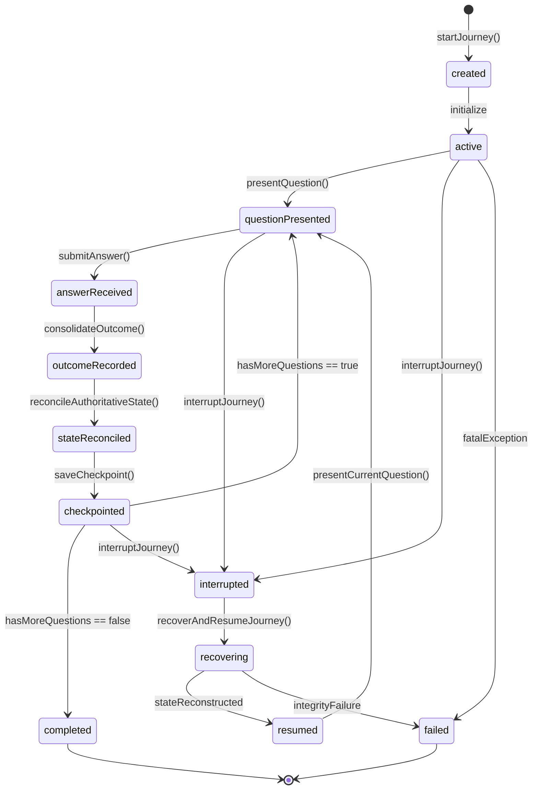

# P41 — Adaptive Learning Production Integration & End-to-End Learner Journey

## 1. Executive Summary & Purpose

Milestone **P41** establishes the production integration layer and end-to-end learner journey within `packages/garuda_learning/`. It unifies the adaptive learning subsystems into a cohesive, deterministic, offline-first orchestration engine:

```
Quiz / PYQ Corpus Ingestion
          ↓
Session Creation & Spec Generation
          ↓
Authoritative State Loading (Recovery/Init)
          ↓
Adaptive Question Selection & Ordering
          ↓
Interactive Practice Execution
          ↓
Outcome Consolidation & Evidence Verification
          ↓
Authoritative State Reconciliation & Monotonic Revision Increment
          ↓
Durable Session Checkpointing (Cryptographic SHA-256 Checksumming)
          ↓
Interruption & Crash Recovery Handling
          ↓
Journey Completion / Session Finalization
```

This orchestrator ties together:
- `AdaptivePracticeSessionOrchestrator` & `AdaptiveQuestionSelector`
- `PracticeExecutionEngine`
- `AuthoritativeLearningStateGateway` & `AuthoritativeLearningStateRecoveryService`
- `SessionCheckpointRepository` & `LearningSessionRecoveryService`
- `AdaptiveLearningJourneyController` (`ChangeNotifier` UI presentation layer)

---

## 2. Architectural Boundaries & Principles

1. **Strict Scope Isolation**:
   - Resides solely within `packages/garuda_learning/`.
   - Zero dependencies on Unreal Engine or GARUDA Game.
   - Clean Architecture: Domain Entities, Repositories, Application Services, and Presentation Adapters.
2. **Deterministic & Offline-First Execution**:
   - All state transitions, checkpoint checksums, and revision counters are mathematically deterministic.
   - All timestamps are caller-injected or ISO-8601 UTC strings.
   - Operates fully offline using in-memory or persisted repositories without network latency or external side-effects.
3. **Multi-Tenant & Session Isolation**:
   - Strict composite key scoping: `(tenantId, learnerId, examId, sessionId)`.
   - Cross-session, cross-learner, and cross-exam isolation enforced at every orchestrator invocation.
   - Recovery operations reject mismatched tenant or exam credentials before any state mutation.
4. **Idempotence & Monotonic Progression**:
   - Duplicate answers to the same question or replayed submissions are detected and rejected.
   - Revisions strictly monotonically increase (`1, 2, 3, ...`).
   - Checkpoints are sealed with SHA-256 integrity hashes.

---

## 3. Journey Lifecycle & State Machine

The learner journey moves through an explicit 13-state deterministic finite state machine (`LearningJourneyStatus`):



### Valid Transition Matrix

| From State | Allowed Target States |
|---|---|
| `created` | `active`, `failed`, `abandoned` |
| `active` | `questionPresented`, `interrupted`, `failed`, `abandoned` |
| `questionPresented` | `answerReceived`, `interrupted`, `failed`, `abandoned` |
| `answerReceived` | `outcomeRecorded`, `failed` |
| `outcomeRecorded` | `stateReconciled`, `failed` |
| `stateReconciled` | `checkpointed`, `failed` |
| `checkpointed` | `questionPresented`, `completed`, `interrupted`, `failed`, `abandoned` |
| `interrupted` | `recovering`, `abandoned`, `failed` |
| `recovering` | `resumed`, `failed` |
| `resumed` | `questionPresented`, `interrupted`, `failed`, `abandoned` |
| `completed` | None (Terminal) |
| `abandoned` | None (Terminal) |
| `failed` | None (Terminal) |

---

## 4. Component Details & Data Flow

### 4.1 Domain Entities

- `LearningJourneyStatus`: Enum of all 13 states with `canTransitionTo(target)` validation.
- `LearningJourneyErrorCode`: Typed error codes (`sessionNotFound`, `tenantMismatch`, `invalidStateTransition`, `checkpointCorrupted`, `questionIndexOutOfBounds`, etc.).
- `LearningJourneyException`: Custom exception carrying error code, technical message, and retryability flags.
- `LearningJourneySession`: Root aggregate holding:
  - Identification: `journeyId`, `learnerId`, `examId`, `tenantId`, `sessionId`.
  - Lifecycle: `status`, `createdAt`, `updatedAt`, `completedAt`.
  - Specs: `sessionSpec` (`AdaptivePracticeSessionSpec`).
  - Runtime: `executionState` (`PracticeExecutionState`).
  - Mastery: `authoritativeState` (`PersistedAuthoritativeLearnerState`).
  - Persistence: `checkpoint` (`SessionCheckpoint`), `answeredQuestionIds`.
- `LearningJourneyStepResult`: Encapsulates step outcomes with progress metrics, current question index, and step timing.

### 4.2 Application Orchestrator (`AdaptiveLearningJourneyOrchestrator`)

Coordinates all phase transitions:
1. `startJourney(...)`:
   - Validates coordinates and input question pool.
   - Loads or recovers authoritative learner state.
   - Selects adaptive questions via `AdaptiveQuestionSelector`.
   - Creates `AdaptivePracticeSessionSpec` via `AdaptivePracticeSessionOrchestrator`.
   - Boots `PracticeExecutionEngine`.
   - Generates initial revision 1 checkpoint (cursor 0).
   - Sets status to `questionPresented` and returns first question.
2. `submitAnswer(...)`:
   - Validates session state, current cursor, and tenant consistency.
   - Submits answer in `PracticeExecutionEngine`.
   - Produces `ActivityOutcomeEvidence` and records outcome.
   - Reconciles state in `AuthoritativeLearningStateGateway`, incrementing revision monotonically.
   - Commits updated checkpoint with updated answered list, SHA-256 checksum, and advanced cursor.
   - If more questions exist, transitions to `questionPresented`; otherwise marks journey `completed`.
3. `interruptJourney(...)`:
   - Transitions active or presented session into `interrupted` state.
   - Preserves latest checkpoint and execution state safely in storage.
4. `recoverAndResumeJourney(...)`:
   - Validates tenant, learner, and exam IDs against requested checkpoint.
   - Verifies SHA-256 cryptographic integrity hash of stored checkpoint.
   - Recovers latest authoritative state.
   - Reconstructs `PracticeExecutionState` at the exact unattempted question cursor via `ResumableAdaptivePracticeCoordinator`.
   - Transitions `recovering` $\rightarrow$ `resumed` $\rightarrow$ `questionPresented`.
   - No questions previously answered are repeated.

### 4.3 Presentation Controller (`AdaptiveLearningJourneyController`)

Exposes a Flutter UI-friendly `ChangeNotifier`:
- `status`: Current `LearningJourneyStatus`.
- `currentQuestion`: Active `AdaptiveSessionQuestion?`.
- `currentQuestionIndex`: 0-based cursor.
- `totalQuestions`: Total questions in session.
- `progressPercentage`: Ratio of completed questions.
- `lastAnswerResult`: Most recent step result.
- `errorMessage`: Active error message if failed.
- Reactive methods: `startJourney`, `submitAnswer`, `interrupt`, `recoverAndResume`.

---

## 5. Persistence, Checkpointing & Crash Recovery

### Checkpoint Schema & Integrity
Each checkpoint stores:
- `checkpointId`, `sessionId`, `learnerId`, `examId`, `tenantId`.
- `currentQuestionIndex`, `completedQuestionCount`, `totalQuestionCount`.
- `revision`: Monotonically increasing integer.
- `answeredQuestionIds`: List of UUIDs completed in order.
- `checksum`: SHA-256 hash computed over `sessionId:learnerId:examId:cursor:revision:answeredCount`.

### Crash Recovery Guarantee
If a process crashes immediately after an answer submission or during presentation:
1. `recoverAndResumeJourney` reads the last valid checkpoint from `SessionCheckpointRepository`.
2. Verifies that the SHA-256 checksum matches the checkpoint contents.
3. Reconstructs execution state positioned at `currentQuestionIndex`.
4. Learner continues with the exact next question without losing historical score or progress.

---

## 6. Multi-Tenant Isolation

All operations validate:
$$\text{req.tenantId} == \text{session.tenantId} \land \text{req.learnerId} == \text{session.learnerId} \land \text{req.examId} == \text{session.examId}$$
Cross-tenant access attempts are rejected with `LearningJourneyErrorCode.tenantMismatch` before any state or data is accessed.

---

## 7. Verification & Test Suite Matrix

The integration is verified by 50 comprehensive automated test items in `test/p41_adaptive_learning_production_integration_test.dart`:

| Item Range | Subsystem / Focus | Key Invariants Verified |
|---|---|---|
| **1 – 10** | End-to-End Learner Journey | Question pool intake, session spec creation, answer flow, sequential progression, final score & completion. |
| **11 – 20** | Dynamic Adaptive Loop | Adaptive selection, difficulty adjustment, outcome consolidation, mastery updates, revision monotonicity. |
| **21 – 25** | Interruption & Resumption | Session interruption, checkpoint persistence, exact question cursor resumption, state preservation. |
| **26 – 30** | Crash Recovery & Integrity | Unscheduled crash recovery, corrupt checkpoint detection, checksum verification, execution reconstruction. |
| **31 – 35** | Multi-Tenant & Multi-Learner Isolation | Cross-tenant isolation, cross-learner independence, separate exam scoping, zero state crosstalk. |
| **36 – 40** | Real-Time UI State Transitions | `ChangeNotifier` state updates, progress calculation, reactive notifications, controller error handling. |
| **41 – 45** | Failure Handling & Graceful Degradation | Corrupt inputs, empty question pool, invalid question indices, gateway failures, retryable errors. |
| **46 – 50** | End-to-End Invariants | Monotonic revisions, zero question duplication, SHA-256 checksum validity, complete lineage tracking. |
