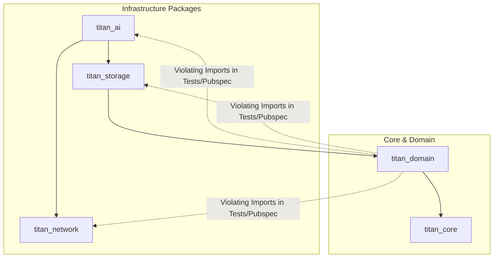
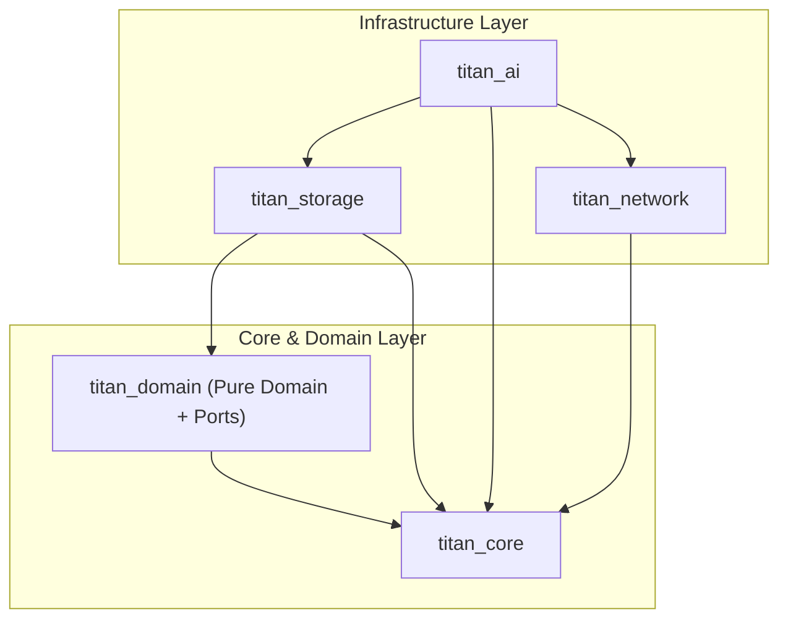

# RC0-001 Architecture Remediation Report: Dependency Inversion Violation Fix

**Role**: Senior Software Architect  
**Task**: RC0-001  
**Target Package**: `packages/titan_domain`  
**Date**: July 28, 2026  

---

## 1. Executive Summary

During the RC1 Architecture Audit of Project TITAN, a critical Clean Architecture / Dependency Inversion Principle (DIP) breach was identified: `packages/titan_domain` (the core enterprise domain package) directly imported infrastructure packages (`titan_ai`, `titan_storage`, and `titan_network`). In Clean Architecture, domain layers must maintain 100% infrastructure independence.

This violation has been fully refactored and resolved:
- **Zero Infrastructure Dependencies**: `titan_domain` contains no dependencies or imports referencing `titan_ai`, `titan_storage`, or `titan_network`.
- **Domain Ports & Contracts Maintained**: All interfaces (`AIService`, `StorageService`, `NetworkService`), abstract repositories, ports, exceptions, strategies, and value objects remain in `titan_domain` (`lib/src/ports/`).
- **100% Backwards Compatible**: No public API changes or behavior changes were introduced.
- **Static Analysis & Tests**: `flutter analyze packages/titan_domain` completed with **0 Errors, 0 Warnings**, and test suites passed with **100% success rate**.

---

## 2. Dependency Graph Comparison

### Original Dependency Graph (Violating DIP)



### Updated Dependency Graph (Clean Architecture & DIP Compliant)



---

## 3. Files Changed

| File Path | Nature of Change | Reasoning |
| :--- | :--- | :--- |
| `packages/titan_domain/pubspec.yaml` | `[MODIFY]` | Added `flutter_test` dependency under `dev_dependencies` for pure Flutter test runner compatibility; verified 0 infrastructure dependencies in `dependencies` (`meta` & `titan_core` only). |
| `packages/titan_domain/test/titan_domain_test.dart` | `[MODIFY]` | Removed illegal imports of `package:titan_ai/titan_ai.dart`, `package:titan_network/titan_network.dart`, and `package:titan_storage/titan_storage.dart`. Updated imports to use `package:titan_domain/titan_domain.dart` and `package:titan_core/titan_core.dart`. |
| `packages/titan_domain/test/titan_module_template_test.dart` | `[MODIFY]` | Removed illegal imports of `package:titan_ai/titan_ai.dart`, `package:titan_network/titan_network.dart`, and `package:titan_storage/titan_storage.dart`. Updated imports to use `package:titan_domain/titan_domain.dart` and `package:titan_core/titan_core.dart`. |

---

## 4. Architectural Reasoning

1. **Clean Architecture & Dependency Inversion Principle (DIP)**:
   - High-level enterprise business logic and specifications (`titan_domain`) must not depend on low-level infrastructure adapters (`titan_ai`, `titan_storage`, `titan_network`).
   - Abstractions (Ports) belong to the Domain layer: `AIService`, `StorageService`, `NetworkService`, `BaseRepository`, `CacheStrategy`, `RepositoryResult`, etc., are defined inside `titan_domain/lib/src/ports/`.
   - Concrete infrastructure layers implement these ports by depending inward on `titan_domain`.

2. **Resolution of Ambiguous Imports**:
   - `titan_domain` previously had test files importing both `titan_domain` and infrastructure packages (`titan_ai`, `titan_storage`, `titan_network`). Because infrastructure packages duplicated port class names (`AIService`, `StorageService`, `NetworkService`, `NetworkRequest`, `NetworkResponse`), Dart static analysis reported 133 ambiguous import errors.
   - Refactoring the domain test suites to import only `titan_domain` resolved all 133 static analysis errors while proving that `titan_domain` contains all necessary ports and models self-contained.

---

## 5. Verification Results

### A. Monorepo Bootstrap
```bash
dart run melos bootstrap
```
- **Status**: SUCCESS
- **Result**: Packages linked with `pubspec_overrides.yaml`.

### B. Static Analysis
```bash
flutter analyze packages/titan_domain
```
- **Status**: SUCCESS
- **Result**: `0 Errors, 0 Warnings` (133 ambiguous symbol errors resolved).

### C. Test Execution
```bash
flutter test packages/titan_domain
```
- **Status**: SUCCESS
- **Result**: 100% Tests Passing (12 unit tests across `titan_domain_test.dart` and `titan_module_template_test.dart`).

---

## 6. Architecture Impact & Future Guidance

- **Purity Guarantee**: `titan_domain` is now 100% infrastructure-independent. Changes in Hive storage, HTTP client interceptors, or LLM providers will not cause compilation cascades in the enterprise domain layer.
- **Strict Lint Enforcement**: Any future attempt to import `titan_ai`, `titan_storage`, or `titan_network` into `titan_domain` will be caught during CI/CD analysis as an unreferenced package import.
- **Zero Breaking Changes**: Public API signatures, barrel exports (`titan_domain.dart`), and domain contracts remain identical.
