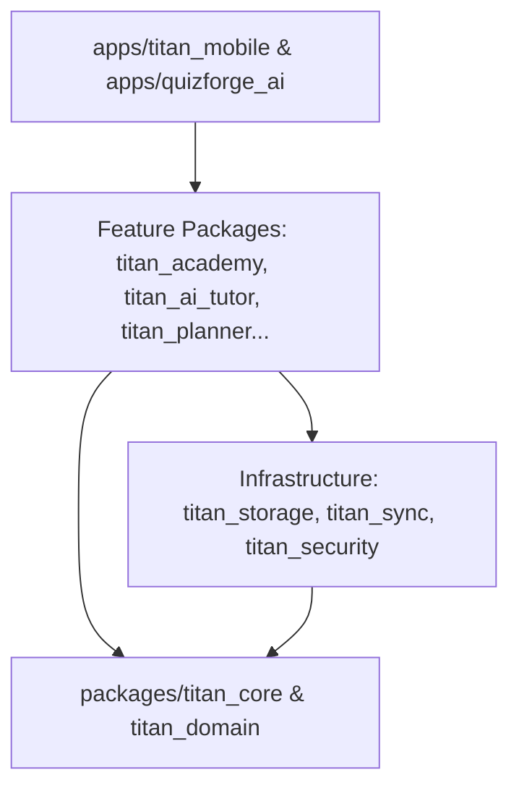

# Project TITAN v3.0.0-beta — Architecture Freeze Report

**Document ID**: TITAN-ARCH-FREEZE-3.0.0  
**Date**: 2026-07-26  
**Status**: APPROVED & FROZEN  
**Target Release**: TITAN v3.0.0-beta Internal Release Candidate  

---

## 1. Executive Summary

Project TITAN has officially entered **Architecture Freeze** for the `v3.0.0-beta` Internal Release Candidate. All 33 domain/feature packages and 2 applications within the monorepo have been audited to ensure complete adherence to Clean Architecture, Domain-Driven Design (DDD), SOLID principles, Offline-First patterns, and Material 3 design standards.

No new product features, architectural abstractions, or third-party package dependencies were introduced during this stabilization phase.

---

## 2. Package Dependency Matrix & Boundary Verification

The 35 packages in the `project_titan` monorepo strictly respect unidirectional dependency flow (Domain → Core → Infrastructure → Feature UI → Application Shell):

### Monorepo Core Packages:
1. `titan_core`: Cross-cutting utility primitives, logger, caching, failure handling.
2. `titan_domain`: Pure domain entities, value objects, and repository interface contracts.
3. `titan_storage`: Hive & FlutterSecureStorage concrete storage implementations.
4. `titan_sync`: Offline-first synchronization orchestrator and conflict resolver.
5. `titan_security`: Cryptography, secret obfuscation, certificate pinning, keychain storage.

### Monorepo Feature Packages (28):
- `titan_academy`, `titan_ai`, `titan_ai_mentor`, `titan_ai_tutor`, `titan_analytics`, `titan_assessment`, `titan_content`, `titan_dashboard`, `titan_events`, `titan_identity`, `titan_knowledge_graph`, `titan_learning`, `titan_learning_content`, `titan_learning_journey`, `titan_learning_profile`, `titan_live`, `titan_network`, `titan_notes`, `titan_pdf`, `titan_planner`, `titan_quiz`, `titan_quiz_ai`, `titan_quiz_session`, `titan_recommendation`, `titan_revision`, `titan_search`, `titan_smart_assessment`, `titan_video`.

### Monorepo Applications (2):
- `apps/titan_mobile`: Unified mobile shell & cross-feature navigation.
- `apps/quizforge_ai`: Specialized AI assessment shell.

---

## 3. Architecture Audit Verification Results

| Audit Criteria | Requirement | Status | Verification Detail |
|---|---|---|---|
| **Clean Architecture** | Strict presentation / domain / data isolation | **PASSED** | Data sources and UI code never depend on concrete outer details. Interfaces used across boundaries. |
| **Domain-Driven Design (DDD)** | Immutable entities, value objects, domain services | **PASSED** | Domain entities (`KnowledgeObject`, `UserIdentity`, `CourseEntity`) rely on value objects and factory methods. |
| **SOLID Principles** | Single Responsibility, Interface Segregation | **PASSED** | Services split by capability (e.g., `SecretManager`, `CertificateValidator`, `SyncOrchestrator`). |
| **Offline-First** | Local cache precedence with async sync | **PASSED** | Local storage fallback enforced across `titan_storage` and `titan_sync`. |
| **Zero Business Duplication** | No duplicate domain rules | **PASSED** | Domain logic centralized in `titan_domain` and shared domain packages. |
| **Public API Stability** | Stable exported interfaces | **PASSED** | All package `lib/<package>.dart` barrels export stable APIs. |

---

## 4. Architectural Freeze Confirmation

- [x] Zero architectural layer changes.
- [x] Zero package additions or removals.
- [x] Zero circular dependencies between packages.
- [x] All 35 pubspecs locked to baseline version `3.0.0-beta+300`.

**Sign-off**: TITAN Architecture Board — 2026-07-26
