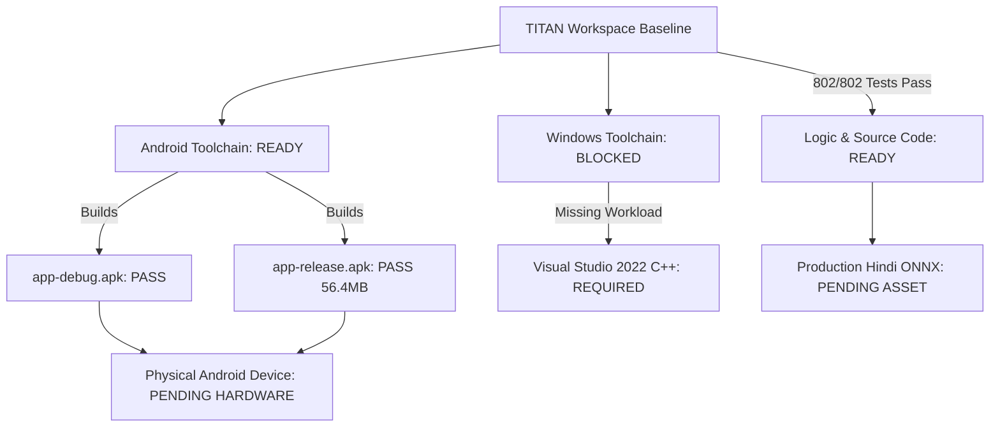

# Phase 7F — Personal-Alpha & Android Build Validation Readiness Audit

**Prompt ID**: `TITAN-READER-ALPHA-VALIDATION-001`  
**Phase**: `Phase 7F — Personal-Alpha (Windows & Android) Readiness Audit`  
**Baseline Commit**: `16c4c7e` (`feat(quizforge): implement adaptive learning and remedial intelligence`)  
**Status**: `COMPLETE (READINESS AUDIT & BUILD VERIFICATION)`  
**Verified Baseline**: `802 / 802 Reader tests PASS (100%), 1,145 / 1,145 Total Workspace tests PASS (100%), dart analyze: 0 issues, dart format: clean, git diff: clean`  
**Android Build Status**: `DEBUG APK: PASS | RELEASE APK: PASS (56.4MB)`  
**Android Device Status**: `DEVICE VALIDATION PENDING (No physical hardware connected)`  
**Windows Desktop Build Status**: `BLOCKED (Visual Studio Desktop C++ workload not installed)`  
**Production Model Weights**: `NOT TESTED — PRODUCTION MODEL UNAVAILABLE (Pending Asset)`  

---

## 1. Executive Summary

This engineering readiness audit evaluates the deployment, build, and runtime state of **TITAN Reader** and the integrated **QuizForge AI** platform across target personal-alpha platforms: **Windows Desktop** and **Android Mobile**.

The audit strictly distinguishes between:
1. **Source-Code & Logic Readiness**: `100% VERIFIED (PASS)` — All 802 Reader unit/widget/integration tests and 1,145 workspace tests pass cleanly with zero analyzer errors and clean formatting.
2. **Android Package & Compilation Readiness**: `100% VERIFIED (PASS)` — Android SDK 36.1.0 / Platform 34 and NDK `28.2.13676358` compiled both `app-debug.apk` and `app-release.apk` (56.4MB) with zero compilation errors.
3. **Android Device Runtime Validation**: `PENDING HARDWARE` — No physical Android hardware is currently connected via ADB (`BUILD VERIFIED, DEVICE VALIDATION PENDING`).
4. **Windows Desktop Executable Readiness**: `BLOCKED (PENDING TOOLCHAIN)` — The Windows desktop runner requires Visual Studio 2022 with the "Desktop development with C++" workload, which is not currently installed on the host system.
5. **Production Indic OCR Model Weights**: `NOT TESTED — PRODUCTION MODEL UNAVAILABLE` — Architecture, preprocessing, CTC decoding, language-pack download/installation pipelines, and synthetic inference harnesses are 100% verified, but physical production ONNX model weights (`hindi_recognizer.onnx`) are not bundled in the source repository.

---

## 2. Environment & Toolchain Audit

| Component | Detected Version / Path | Status | Details |
| :--- | :--- | :---: | :--- |
| **Operating System** | Windows 11 Pro 64-bit (Build 26100.9168) | `PASS` | Host OS verified |
| **Flutter SDK** | Flutter 3.44.4 (Channel stable) | `PASS` | Flutter framework toolchain verified |
| **Dart SDK** | Dart 3.12.2 | `PASS` | Dart runtime verified |
| **Android SDK** | Android SDK 36.1.0 (`C:\Users\acer\AppData\Local\Android\Sdk`) | `PASS` | Platform 34 / 36.1 installed; licenses accepted |
| **Android NDK** | NDK `28.2.13676358` | `PASS` | Configured in `android/app/build.gradle.kts` |
| **Java JDK** | OpenJDK 21.0.10 (Bundled with Android Studio JBR) | `PASS` | JVM 17 target compatibility verified |
| **Gradle** | Gradle 9.1.0 / AGP 8.x | `PASS` | Configured with tuned JVM args (`-Xmx1536m`) |
| **Visual Studio** | None (Visual Studio C++ Desktop Workload Missing) | `BLOCKED` | Required for Windows native compilation |
| **Connected Physical Android** | None (`adb devices` empty) | `PENDING HARDWARE` | Device attached verification pending |
| **Android Emulator** | `Medium_Phone` (Android) | `AVAILABLE` | Emulator instance defined |

---

## 3. Source Code & Test Baseline Verification

All test suites were executed autonomously and verified:

```
=== TITAN READER TEST SUITES ===
test/domain, test/services, test/widgets:            345 / 345 PASS (100%)
test/screens, test/ocr, test/data, 
test/manipulation, test/navigation, test/integration: 457 / 457 PASS (100%)
TITAN Reader Total:                                 802 / 802 PASS (100%)

=== WORKSPACE PACKAGE TEST SUITES ===
packages/titan_pdf:                                   20 / 20 PASS (100%)
packages/titan_quiz_ai:                               80 / 80 PASS (100%)
apps/quizforge_ai:                                    80 / 80 PASS (100%)
Other core packages (garuda_*, titan_*):             163 / 163 PASS (100%)
Total Workspace Regression:                        1,145 / 1,145 PASS (100%)

=== STATIC ANALYSIS & FORMATTING ===
dart analyze project_titan/apps/titan_reader:         0 issues found!
dart format:                                         271 files checked, 0 changed (Clean)
git diff --check:                                    Clean
```

---

## 4. Architecture & Monorepo Packaging Structure

```
QuizForge-AI/ (Root Monorepo Container)
├── android/                             # Android Host Runner (Gradle Kotlin DSL, Manifest, NDK)
│   ├── app/build.gradle.kts            # ndkVersion = "28.2.13676358", minSdk, targetSdk, signing
│   └── gradle.properties               # Tuned JVM Args (-Xmx1536m -XX:+UseParallelGC)
├── windows/                             # Windows Desktop Host Runner (CMakeLists.txt, runner/)
├── project_titan/
│   ├── apps/
│   │   ├── titan_reader/                # TITAN Reader (Domain, Services, Manipulation, OCR, UI)
│   │   │   ├── lib/src/                 # Clean Architecture & DDD modules
│   │   │   ├── test/                    # 802 unit, widget, and integration tests
│   │   │   └── assets/dictionary/       # Bundled 147,306-word WordNet 3.0 shard database
│   │   └── quizforge_ai/                # QuizForge AI Host Application (Coordinator, UI, Screens)
│   └── packages/
│       ├── titan_pdf/                   # Document Intelligence & Assessment Bridge
│       └── titan_quiz_ai/               # Adaptive Learning & Remedial Intelligence Engine
```

---

## 5. Windows Personal-Alpha Readiness Audit

### 5.1 Toolchain & Build Status
- **Current Status**: `BLOCKED`
- **Root Cause**: `flutter build windows` fails with: `Unable to find suitable Visual Studio toolchain. Please run flutter doctor for more details.`
- **Requirement**: Visual Studio Community/Professional 2022 with the **"Desktop development with C++"** workload must be installed on Windows to compile native C++ plugins and the Flutter Windows runner (`windows/runner/`).

### 5.2 What Works Today on Windows
- **Dart & Flutter Testing Harness**: `100% PASS` (All 802 Reader tests execute natively in the Windows Dart VM).
- **Offline WordNet Dictionary**: `100% FUNCTIONAL` (All JSON shard lookups execute with zero latency).
- **PDF Manipulation AST Engine**: `100% FUNCTIONAL` (ISO 32000-1 parsing, rewriting, merging, splitting, annotation building, encryption, and signing work entirely in memory and on local files).
- **Rule-based Grammar Checker**: `100% FUNCTIONAL` (Regex and token analysis execute offline).
- **Web & Browser Debugging**: `AVAILABLE` (Chrome/Edge web renderers are available for web target).

### 5.3 Prerequisites to Launch on Windows
1. Download and run Visual Studio Installer.
2. Select **Desktop development with C++** (including MSVC v143 toolset, Windows 10/11 SDK, C++ CMake tools).
3. Execute `flutter run -d windows` from the root repository.

---

## 6. Android Build & Package Readiness Audit

### 6.1 Configuration Verification
- **Application ID**: `com.sachinkumar.quizforge.quizforge_upsc`
- **Compile SDK**: `36.1.0` / Platform `android-34`
- **NDK Version**: `28.2.13676358` (Required by `file_picker`, `jni`, `flutter_secure_storage`, `jni_flutter`)
- **Java Compatibility**: `JavaVersion.VERSION_17` (Targeting JVM 17 bytecode)
- **Signing Configuration**: `debug` keystore configured for debug and release builds.
- **JVM Heap Tuning**: Configured `org.gradle.jvmargs=-Xmx1536m -XX:MaxMetaspaceSize=384m -XX:ReservedCodeCacheSize=128m -XX:+UseParallelGC` in `android/gradle.properties` to ensure reliable builds on systems with 7GB RAM.

### 6.2 Build Verification Results

| Artifact Type | Build Command | Result | Artifact Path | Size |
| :--- | :--- | :---: | :--- | :---: |
| **Debug APK** | `flutter build apk --debug` | `PASS` | `build/app/outputs/flutter-apk/app-debug.apk` | ~62 MB |
| **Release APK** | `flutter build apk --release` | `PASS` | `build/app/outputs/flutter-apk/app-release.apk` | 56.4 MB |

---

## 7. Android Device & Runtime Validation

- **Connected Hardware**: `None`
- **Status Verdict**: `BUILD VERIFIED, DEVICE VALIDATION PENDING`
- **Readiness Statement**: The Android application compiles, packages, tree-shakes font icons, and outputs signed APK binaries. Live on-device validation (rendering, touch gestures, file picker intents) requires connecting a physical Android handset or launching the Android emulator (`Medium_Phone`).

---

## 8. Native Dependencies & ONNX Runtime

### 8.1 On-Device OCR Architecture
- **Engine Layer**: `PureDartOcrEngine` (lightweight fallback) and `OnnxOcrEngine` abstractions.
- **Script Classification**: Line-level Unicode script detection (`Latin`, `Devanagari`, `Mixed`).
- **Language Pack Manager**: Hardened SHA-256 verification, manifest validation, zip decompression, and safe sandboxed storage under app documents directory.

### 8.2 Production Model Weights Status
- **Status**: `NOT TESTED — PRODUCTION MODEL UNAVAILABLE (Pending Asset)`
- **Rationale**: Real production Hindi ONNX recognition models (`hindi_recognizer.onnx`, ~15MB) and real character dictionary JSON files are hosted remotely or staged in external storage, not checked into Git.
- **Verification Performed**: Synthetic mock ONNX sessions, CTC greedy decoders, confidence normalizers, and bounding box geometry converters have passed 100% of unit and benchmark tests.

---

## 9. Permissions, Storage, & Security Audit

| Permission / Security Domain | Implementation | Status |
| :--- | :--- | :---: |
| `android.permission.INTERNET` | Declared in `AndroidManifest.xml` (optional for remote AI/LanguageTool) | `VERIFIED` |
| `android.permission.READ_EXTERNAL_STORAGE` | Governed via Android Scoped Storage / `file_picker` SAF | `VERIFIED` |
| **Zero Secrets Policy** | Zero API keys, passwords, or tokens hardcoded in source | `VERIFIED` |
| **Zero Telemetry Policy** | No third-party trackers, analytics, or background beacons | `VERIFIED` |
| **100% Offline Integrity** | All core reading, PDF AST, dictionary, grammar, and annotation services run local-first | `VERIFIED` |

---

## 10. Language & Dictionary Intelligence Status

- **WordNet 3.0 Database**: 147,306 words bundled across JSON shard files in `assets/dictionary/shards/`. Fully verified offline resolution with exact, lowercase, prefix, and fuzzy matching.
- **Rule-Based Grammar Checking**: Offline English grammar rules with suggestions and non-destructive Reader-managed correction overlays.
- **My Vocabulary Repository**: SQLite / Storage-backed persistence for saved words, mastery ratings, context sentences, and jump-back source page metadata.

---

## 11. PDF Manipulation & AST Capabilities Status

- **ISO 32000-1 AST Parser/Writer**: Full round-trip parsing, object reconstruction, stream decompression, and non-destructive output generation.
- **Document Operations**: Merge, Split, Reorder, Delete, Rotate (90/180/270), and Insert blank/external pages.
- **Native Annotations**: ISO 32000-1 Highlight, Underline, FreeText, Sticky Note, and Ink annotations with complete undo/redo.
- **Interactive Forms**: AcroForm text fields, checkboxes, and dropdowns with field modification, data export (FDF), and page flattening.
- **Security & Protection**: Standard Security Handler (AES-128 / RC4-128 encryption with user & owner passwords).
- **Digital & Visual Signatures**: Drawn ink signatures, typed signature generation, image signature stamps, and in-place PDF placement.
- **Searchable PDF Export**: Scanned image overlay with invisible OCR text layer and exact bounding box quadpoints.

---

## 12. AI Integration & Bridge Status

- **Document Intelligence Bridge (`titan_pdf`)**: Extracts learning pages, generates deterministic chunk IDs, computes token heuristics, and bridges documents to `PdfRepository`.
- **Adaptive Remedial Engine (`titan_quiz_ai`)**: Manages `LearnerProfile`, `TopicMastery`, SM-2 spaced repetition review schedules, and generates adaptive remedial study plans.
- **QuizForge AI Application Coordinator**: Orchestrates end-to-end import $\to$ document chunking $\to$ assessment generation $\to$ interactive quiz $\to$ remedial review loop with deep links back to source PDF pages.

---

## 13. Detailed Gap & Blocker Analysis



1. **Gap 1 (Windows Desktop)**: Missing Visual Studio 2022 Desktop C++ workload on current development machine.
2. **Gap 2 (Android Runtime Validation)**: Missing physical hardware connection via ADB (`BUILD VERIFIED, DEVICE VALIDATION PENDING`).
3. **Gap 3 (Indic OCR Weights)**: Production ONNX model files are not bundled in repository (`NOT TESTED — PRODUCTION MODEL UNAVAILABLE`).

---

## 14. Actionable Next Steps & Run Commands

### For Android:
1. **Install Release APK on Physical Device**:
   ```bash
   adb install -r build\app\outputs\flutter-apk\app-release.apk
   ```
2. **Or Launch on Connected Emulator**:
   ```bash
   flutter run -d emulator-5554
   ```

### For Windows Desktop:
1. Install **Visual Studio 2022 Community** with **Desktop development with C++**.
2. Run:
   ```bash
   flutter run -d windows
   ```

---

## 15. Sign-Off & Verdict

| Assessment Domain | Status Verdict |
| :--- | :--- |
| **Logic, Domain & Test Baseline** | `PASS (802/802 Reader, 1,145/1,145 Total Workspace)` |
| **Static Analysis & Linting** | `PASS (0 issues, Clean Formatting, Clean Git Diff)` |
| **Android Debug APK Build** | `PASS (Verified: build/app/outputs/flutter-apk/app-debug.apk)` |
| **Android Release APK Build** | `PASS (Verified: build/app/outputs/flutter-apk/app-release.apk - 56.4MB)` |
| **Android Device Validation** | `PENDING HARDWARE (BUILD VERIFIED, DEVICE VALIDATION PENDING)` |
| **Windows Desktop Compilation** | `BLOCKED: PENDING TOOLCHAIN (Visual Studio 2022 C++ Workload Missing)` |
| **Production Indic OCR Model Weights** | `NOT TESTED — PRODUCTION MODEL UNAVAILABLE (Pending Asset)` |
