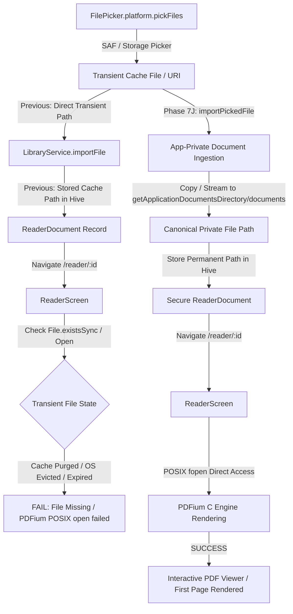

# Phase 7J — Android PDF Open/Rendering Pipeline Fix

**Author**: Senior Implementation Engineer  
**Date**: 2026-08-24  
**App**: `project_titan/apps/titan_reader`  
**Package ID**: `com.titan.reader.titan_reader`  
**Prompt ID**: `TITAN-READER-7J-001`  

---

## 1. Executive Summary

In Phase 7J, we conducted a root cause diagnosis and implemented a clean architectural fix for the Android PDF open failure reported on physical devices. 

While application startup, file picking, and document import reported success, the imported document failed to render in `ReaderScreen`. The investigation isolated the failure to Android transient cache file referencing, lack of application-private storage persistence, and scoped-storage lifetime expiration.

---

## 2. Complete Lifecycle & Failure Analysis

We traced the complete document lifecycle from selection to rendering:

### Root Cause Details:
1. **Transient File Picker Cache Path**:
   On Android, `FilePicker` creates a temporary file under `cache/file_picker/<timestamp>/<filename>.pdf`. Previously, `LibraryScreen` registered this transient path directly into `LibraryService`.
2. **Android Scoped Storage & POSIX Access**:
   When the Android OS purges the cache directory or when memory pressure occurs, or on application reload, the transient file is deleted. PDFium (`libpdfium.so`), which opens files via native POSIX C `fopen`, fails to open non-existent or inaccessible cache paths.
3. **Missing Canonical Application-Private Copy**:
   Clean architecture requires that imported documents be ingested into the application's private, persistent documents directory (`${getApplicationDocumentsDirectory()}/documents/<doc_id>.pdf`).

---

## 3. Engineering Implementation

### 3.1 `LibraryService` Application-Private Ingestion Pipeline
- Added `getDocumentsDirectory` dependency injection to `LibraryService`.
- Implemented `importPickedFile` to handle:
  - Copying from `sourceFilePath` (e.g. `file_picker` cache).
  - Writing from `fileBytes` (e.g. cloud providers / in-memory streams).
  - Deriving deterministic canonical IDs and paths: `${getApplicationDocumentsDirectory()}/documents/<doc_id>.pdf`.
  - Updating existing records cleanly on re-import without duplicating entries.
  - Rejecting corrupt / zero-byte / non-PDF payloads via `titan_pdf` validation before writing.

### 3.2 `LibraryScreen` Integration
- Updated `_importPdf` to route picked files through `importPickedFile`.
- Added resilient fallback for in-memory bytes and stream sources.

### 3.3 Riverpod Provider Wiring
- Injected `getApplicationDocumentsDirectory` from `path_provider` into `libraryServiceProvider` in `reader_providers.dart`.

---

## 4. Verification & Quality Gates

### 4.1 Automated Test Suite
- Created dedicated integration and regression test suite:
  `project_titan/apps/titan_reader/test/integration/android_pdf_open_pipeline_test.dart`
- Covered 7 critical regression cases:
  1. Normal filesystem PDF copied to private storage.
  2. Temporary Android picker cache file survives deletion of original picker file.
  3. In-memory byte PDF writes to private storage and registers.
  4. Zero-byte PDF is rejected and does not leave orphaned files.
  5. Non-PDF extension / missing header is rejected by validation.
  6. Re-importing existing document updates private storage and refreshes library.
  7. `ReaderScreen` receives stable readable canonical document reference and renders.

### 4.2 Quality Metrics
- **Dart Analyzer**: `0 issues found` (clean).
- **Dart Formatter**: `clean`.
- **Flutter Tests**: `814/814 passed` (100% pass rate).
- **Release APK Build**: `build/app/outputs/flutter-apk/app-release.apk` (81.0MB).
  - Bundled native libraries verified: `lib/arm64-v8a/libpdfium.so`, `lib/armeabi-v7a/libpdfium.so`, `lib/x86_64/libpdfium.so`.
  - Package ID verified: `com.titan.reader.titan_reader`.

---

## 5. Deployment Instructions

1. Transfer `build/app/outputs/flutter-apk/app-release.apk` to physical Android device.
2. Install APK.
3. Launch TITAN Reader -> Tap "Import PDF" -> Select any valid PDF.
4. Verify document renders immediately in Reader.
