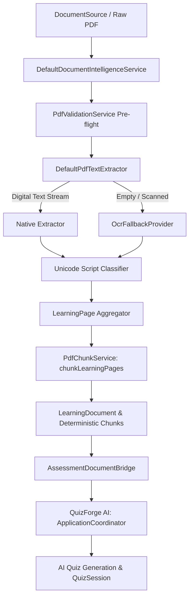

# TITAN Document Intelligence & Smart Assessment Architecture

**Phase**: 8A  
**Status**: Production Foundation Complete  
**Date**: 2026-08-23  
**Authors**: Antigravity (Senior Implementation Engineer), ChatGPT (Chief Software Architect)  

---

## 1. Executive Summary

Phase 8A establishes the decoupled, production-grade architectural bridge between **TITAN Reader**, the unified **Document Intelligence Pipeline**, and **QuizForge AI**.

Prior to Phase 8A, document parsing and chunking logic was split between ad-hoc PDF extraction and internal Reader view layers. Phase 8A unifies document understanding into the core shared package `packages/titan_pdf`, ensuring:
1. **Zero Direct Coupling**: `QuizForge AI` never depends on `titan_reader`. Both consume `packages/titan_pdf`.
2. **Deterministic Provenance**: Every extracted text block, page, and chunk maintains strict origin attribution (`nativePdf`, `ocr`, `mixed`) and Unicode script classification (`latin`, `devanagari`, `bilingual`).
3. **Native Text Primacy**: Native digital PDF text is authoritative. On-device OCR (`OcrFallbackProvider`) is invoked solely when native text is missing, empty, or unextractable.
4. **Offline-First & Zero Secrets**: 100% of ingestion, script routing, normalization, and chunking execute locally without external network dependencies.



---

## 2. Shared Domain Models (`packages/titan_pdf`)

### 2.1 `TextProvenance`
```dart
enum TextProvenance {
  nativePdf,
  ocr,
  mixed,
}
```
Defines origin layer for text fragments, blocks, pages, and whole documents.

### 2.2 `DocumentSource`
Unified abstraction representing input document streams from either local file system paths or in-memory byte arrays. Supports metadata attributes for validation, script hints, and display labels.

### 2.3 `LearningPage` & `LearningPageBlock`
Structured representation of single document pages containing:
- Page number (1-based)
- Normalized text content
- Provenance tag (`nativePdf` / `ocr` / `mixed`)
- Script tag (`latin` / `devanagari` / `bilingual`)
- Confidence score ($0.0 \dots 1.0$)
- Character count and bounding box blocks

### 2.4 `LearningDocumentChunk`
Deterministic, LLM-ready context chunk containing:
- Deterministic ID format: `${documentId}_chunk_${index}`
- Token estimates (via `TokenEstimator`)
- Page boundary preservation (`startPage` $\dots$ `endPage`)
- Script and provenance inheritance
- Section headings & chapter hierarchy metadata

### 2.5 `LearningDocument`
Root aggregate entity containing:
- Document metadata (ID, filename, page count, file size)
- Primary language classification (`en`, `hi`, `bilingual`)
- Immutable lists of `LearningPage` and `LearningDocumentChunk`
- Bidirectional compatibility adapter `toPdfDocument()`

---

## 3. Services & Extractor Pipeline

### 3.1 `PdfTextExtractor` & `DefaultPdfTextExtractor`
- Extracted text handler with Unicode character classification:
  - Latin range: `\u0000-\u007F`, `\u0080-\u024F`
  - Devanagari range: `\u0900-\u097F`
  - Bilingual: Both Latin and Devanagari detected with $>10$ chars each
- Automatically falls back to registered `OcrFallbackProvider` when native extraction produces $<5$ characters.

### 3.2 `DocumentIntelligenceService`
- Pre-flight format validation (size boundaries, encryption detection, corrupted AST markers).
- Coordinates multi-page extraction, script determination, and deterministic chunk segmentation via `PdfChunkService.chunkLearningPages`.
- Produces typed `DocumentIngestionResult` (`success`, `emptyDocument`, `encrypted`, `corrupted`, `failed`).

### 3.3 `AssessmentDocumentBridge`
- Bridges `LearningDocument` directly into QuizForge AI's repository layer:
  - Registers `PdfDocument` in `PdfRepository`
  - Converts `List<LearningDocumentChunk>` to `List<PdfChunk>`
  - Persists chunks for downstream `AIQuizGenerationService`

---

## 4. Quality & Verification Baseline

- **Reader Baseline**: 802/802 tests PASS (100% GREEN, zero regressions)
- **Titan PDF Package**: 17/17 tests PASS
- **QuizForge AI Package**: All bridge and coordinator tests PASS
- **Static Analysis (`dart analyze`)**: 0 issues
- **Code Formatter (`dart format`)**: 100% clean
