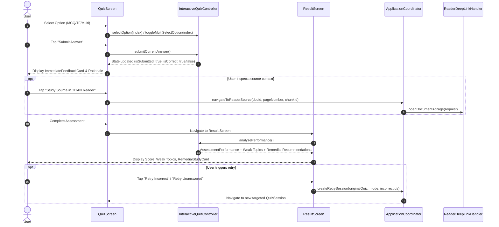

# PROJECT TITAN — INTERACTIVE ASSESSMENT & REMEDIAL STUDY LOOP ARCHITECTURE

## 1. Executive Summary

Phase 8C establishes the production-grade interactive assessment experience within QuizForge AI and closes the loop with TITAN Reader via deterministic remedial study navigation. This document outlines the architectural patterns, contracts, and lifecycle guarantees enabling immediate post-submission feedback, multi-format question handling, weak area detection, and offline source page deep linking.

---

## 2. Architecture & Layering Principles

```
+--------------------------------------------------------------------------+
|                             QuizForge AI UI                              |
| (QuizScreen, ImmediateFeedbackCard, QuestionProgressStrip, ResultScreen) |
+--------------------+---------------------------------+-------------------+
                     |                                 |
                     v                                 v
       +---------------------------+     +---------------------------+
       | InteractiveQuizController |     |   ApplicationCoordinator  |
       +-------------+-------------+     +-------------+-------------+
                     |                                 |
                     v                                 v
+--------------------------------------------------------------------------+
|                   packages/titan_quiz_ai (Domain)                        |
|  - InteractiveQuestionState / AnswerStatus                               |
|  - AssessmentPerformanceAnalyzer / AssessmentPerformance                 |
|  - RemedialStudyRecommendation / RetryMode                               |
+--------------------------------------------------------------------------+
                     |
                     v
+--------------------------------------------------------------------------+
|                     packages/titan_pdf (Shared)                          |
|  - ReaderDeepLinkRequest (documentId, pageNumber, chunkId, boundingBox)   |
|  - ReaderDeepLinkHandler / InMemoryReaderDeepLinkHandler                 |
+--------------------------------------------------------------------------+
```

### 2.1 Clean Architecture Invariants
- **Unidirectional Dependency**: `QuizForge AI` -> `shared packages (titan_pdf, titan_quiz_ai, titan_quiz)` <- `TITAN Reader`.
- **Zero Reader UI Coupling**: QuizForge AI never imports `titan_reader` widgets, screens, providers, OCR engines, or ONNX runtimes.
- **Engine-Independent Contracts**: Reader navigation is requested through immutable `ReaderDeepLinkRequest` objects handled via `ReaderDeepLinkHandler`.
- **100% Deterministic & Offline**: Scoring, accuracy calculations, weak-topic classifications, and retry filtering operate deterministically in memory without network or AI API dependencies.

---

## 3. Core Domain Entities & Contracts

### 3.1 Answer Status Model
```dart
enum AnswerStatus {
  unanswered,
  selected,
  submitted,
  correct,
  incorrect,
  reviewed,
}
```

### 3.2 Interactive Question State (`InteractiveQuestionState`)
Encapsulates single and multiple choice selections, submission state, immediate evaluation results, review markers, and source page references:
- `selectedOptionIndices`: `Set<int>` supporting single-select, True/False, and multi-select formats.
- `isSubmitted`: `bool` guarding feedback display until user confirmation.
- `isCorrect`: `bool?` computed upon submission against question target.
- `markedForReview`: `bool` toggleable for deferred reconsideration.
- `pageReference` & `chunkId`: Grounding coordinates pointing back to the ingested document.

### 3.3 Assessment Performance Analysis (`AssessmentPerformanceAnalyzer`)
Analyzes full assessment sessions with configurable weak area thresholds (default `< 60%` accuracy):
- **Overall Statistics**: `totalQuestions`, `answeredQuestions`, `correctAnswers`, `incorrectAnswers`, `unansweredQuestions`, `percentage`, `totalScore`, `maxPossibleScore`.
- **Breakdown**: Accuracy by question type (`MCQ`, `True/False`, `Multiple Select`) and accuracy by topic.
- **Topic Classification**: `weakTopics` vs `strongTopics`.
- **Remedial Recommendations**: Generates `RemedialStudyRecommendation` objects with direct deep links to source pages and retry question actions.

### 3.4 Deep-Link Navigation (`ReaderDeepLinkRequest`)
```dart
class ReaderDeepLinkRequest {
  final String documentId;
  final int pageNumber;
  final String? chunkId;
  final String? selectedText;
  final Rect? boundingRegion;
  final String source;
}
```

---

## 4. User Interaction & Remedial Study Flow



---

## 5. Security, Memory & Verification Invariants

1. **Zero AI Token Leaks**: Interactive answering and evaluation execute completely on-device without quota consumption.
2. **Deterministic Remedial Deep Links**: Source links require valid document IDs and positive 1-based page indices.
3. **Immutability**: All analytical aggregates (`AssessmentPerformance`, `RemedialStudyRecommendation`) are deeply immutable.
4. **Offline Resilience**: Complete assessment flow functions in isolated, air-gapped runtime environments.
